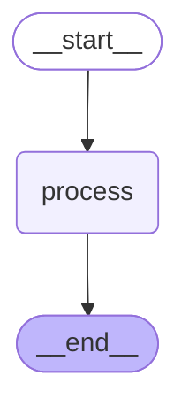
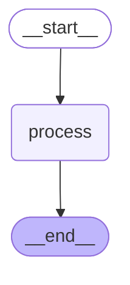
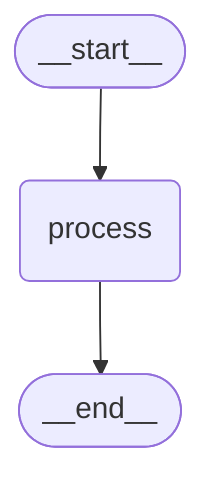
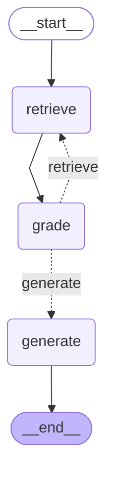
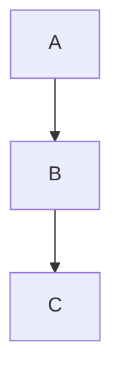

# 图可视化 - 核心概念2: draw_mermaid() 方法

## 概念定位

**核心概念**: draw_mermaid() 方法
**重要程度**: ⭐⭐⭐⭐⭐ (最高)
**使用频率**: 极高
**难度等级**: ⭐ (简单)

## 一句话定义

**draw_mermaid() 是 Graph 对象的方法,用于将图结构转换为 Mermaid 文本语法,是生成可视化图表的核心步骤。**

## 详细解释

### 方法签名

```python
def draw_mermaid(
    self,
    *,
    with_styles: bool = True,
    curve_style: CurveStyle = CurveStyle.LINEAR,
    node_colors: NodeStyles = NodeStyles.default(),
    wrap_label_n_words: int = 9,
) -> str:
    """Draw the graph as a Mermaid syntax string."""
```

**参数说明**:
- `with_styles`: 是否包含样式信息 (默认 True)
- `curve_style`: 边的曲线样式 (LINEAR, BASIS, CARDINAL 等)
- `node_colors`: 节点颜色配置
- `wrap_label_n_words`: 标签换行的单词数

**返回值**:
- `str`: Mermaid 格式的文本字符串

[来源: reference/context7_langchain_01.md - Python API]

### 核心功能

#### 1. 生成 Mermaid 文本语法

draw_mermaid() 将 Graph 对象转换为 Mermaid 文本:

```python
from langgraph.graph import StateGraph, START, END
from typing import TypedDict

# 定义状态
class State(TypedDict):
    messages: list[str]

# 创建图
workflow = StateGraph(State)
workflow.add_node("process", lambda x: {"messages": x["messages"] + ["processed"]})
workflow.add_edge(START, "process")
workflow.add_edge("process", END)

app = workflow.compile()

# 生成 Mermaid 文本
mermaid_text = app.get_graph().draw_mermaid()
print(mermaid_text)
```

**输出示例**:


[来源: reference/context7_langgraph_01.md - 基础可视化模式]

#### 2. 控制样式输出

使用 `with_styles` 参数控制是否包含样式:

```python
# 带样式 (默认)
mermaid_with_styles = app.get_graph().draw_mermaid(with_styles=True)

# 不带样式 (用于快照测试)
mermaid_no_styles = app.get_graph().draw_mermaid(with_styles=False)
```

**对比**:

带样式:


不带样式:


[来源: reference/source_图可视化_01.md - Graph 对象使用示例]

#### 3. 自定义曲线样式

使用 `curve_style` 参数自定义边的曲线样式:

```python
from langchain_core.runnables.graph import CurveStyle

# 线性样式 (默认)
mermaid_linear = app.get_graph().draw_mermaid(curve_style=CurveStyle.LINEAR)

# 基础曲线样式
mermaid_basis = app.get_graph().draw_mermaid(curve_style=CurveStyle.BASIS)

# 基数曲线样式
mermaid_cardinal = app.get_graph().draw_mermaid(curve_style=CurveStyle.CARDINAL)
```

**CurveStyle 枚举值**:
- `LINEAR`: 直线连接
- `BASIS`: B样条曲线
- `CARDINAL`: 基数样条曲线
- `NATURAL`: 自然曲线
- `STEP`: 阶梯样式
- `STEP_BEFORE`: 阶梯样式(前置)
- `STEP_AFTER`: 阶梯样式(后置)

[来源: reference/context7_langgraph_01.md - 样式定制]

#### 4. 自定义节点颜色

使用 `node_colors` 参数自定义节点颜色:

```python
from langchain_core.runnables.graph import NodeStyles

# 自定义节点颜色
custom_colors = NodeStyles(
    default="#f2f0ff",
    first="#e0f7fa",
    last="#bfb6fc"
)

mermaid_custom = app.get_graph().draw_mermaid(node_colors=custom_colors)
```

[来源: reference/context7_langgraph_01.md - 样式定制]

### Mermaid 语法基础

#### 1. 图类型声明

```mermaid
graph TD;  # TD = Top Down (从上到下)
# 其他选项:
# graph LR;  # LR = Left Right (从左到右)
# graph BT;  # BT = Bottom Top (从下到上)
# graph RL;  # RL = Right Left (从右到左)
```

#### 2. 节点定义

```mermaid
# 矩形节点
node1(Node 1)

# 圆角矩形节点
node2([Node 2])

# 菱形节点 (决策节点)
node3{Decision}

# 圆形节点
node4((Circle))

# 六边形节点
node5{{Hexagon}}
```

#### 3. 边定义

```mermaid
# 普通边
A --> B

# 带标签的边
A -->|label| B

# 虚线边
A -.-> B

# 粗边
A ==> B

# 条件边 (带标签)
A -->|condition| B
```

#### 4. 样式定义

```mermaid
# 定义样式类
classDef default fill:#f2f0ff,line-height:1.2
classDef first fill-opacity:0
classDef last fill:#bfb6fc

# 应用样式
node1:::first
node2:::last
```

[来源: reference/context7_langgraph_01.md - Mermaid 语法基础]

### 实际应用场景

#### 场景1: 快速查看图结构

```python
# 开发阶段快速查看
print(app.get_graph().draw_mermaid())

# 输出到文件
with open("graph.mmd", "w") as f:
    f.write(app.get_graph().draw_mermaid())
```

#### 场景2: 生成文档

```python
# 为 Markdown 文档生成图表
mermaid_text = app.get_graph().draw_mermaid()

# 嵌入到 Markdown
markdown_doc = f"""
# 工作流文档

## 图结构

```mermaid
{mermaid_text}
```

## 说明
...
"""

with open("README.md", "w") as f:
    f.write(markdown_doc)
```

[来源: reference/context7_langgraph_01.md - 文档生成场景]

#### 场景3: 调试复杂工作流

```python
# 使用 xray 参数展开子图
mermaid_detailed = app.get_graph(xray=True).draw_mermaid()

# 保存到文件用于分析
with open("graph_detailed.mmd", "w") as f:
    f.write(mermaid_detailed)

# 使用在线 Mermaid 编辑器查看
# https://mermaid.live/
```

#### 场景4: 对比不同配置

```python
# 对比不同 xray 参数的输出
mermaid_simple = app.get_graph(xray=False).draw_mermaid()
mermaid_detailed = app.get_graph(xray=True).draw_mermaid()

print("简单视图长度:", len(mermaid_simple))
print("详细视图长度:", len(mermaid_detailed))
```

### 与其他方法的关系

#### 1. get_graph() → draw_mermaid()

```python
# 标准流程
graph = app.get_graph()
mermaid_text = graph.draw_mermaid()
```

#### 2. draw_mermaid() → 在线渲染

```python
# 生成 Mermaid 文本
mermaid_text = app.get_graph().draw_mermaid()

# 使用在线工具渲染
# 1. https://mermaid.live/
# 2. https://mermaid.ink/
# 3. GitHub/GitLab Markdown 自动渲染
```

#### 3. draw_mermaid() vs draw_mermaid_png()

```python
# draw_mermaid() - 文本输出
text = app.get_graph().draw_mermaid()
print(type(text))  # <class 'str'>

# draw_mermaid_png() - 二进制输出
png = app.get_graph().draw_mermaid_png()
print(type(png))  # <class 'bytes'>
```

**选择建议**:
- **开发阶段**: 使用 `draw_mermaid()` 快速查看文本
- **文档阶段**: 使用 `draw_mermaid_png()` 生成图像
- **版本控制**: 使用 `draw_mermaid()` 文本易于 diff

[来源: reference/context7_langchain_01.md - 最佳实践]

### 输出格式详解

#### 1. 完整输出示例

```python
from langgraph.graph import StateGraph, START, END

workflow = StateGraph(State)
workflow.add_node("retrieve", lambda x: x)
workflow.add_node("grade", lambda x: x)
workflow.add_node("generate", lambda x: x)
workflow.add_edge(START, "retrieve")
workflow.add_edge("retrieve", "grade")
workflow.add_conditional_edges(
    "grade",
    lambda x: "generate" if x.get("relevant") else "retrieve",
    {
        "generate": "generate",
        "retrieve": "retrieve"
    }
)
workflow.add_edge("generate", END)

app = workflow.compile()
print(app.get_graph().draw_mermaid())
```

**输出**:


**格式说明**:
- `%%{init: ...}%%`: Mermaid 初始化配置
- `graph TD;`: 图类型声明 (Top Down)
- `node([label])`: 节点定义
- `node1 --> node2;`: 边定义
- `node1 -.->|label| node2;`: 条件边定义
- `classDef ...`: 样式类定义
- `node:::class`: 应用样式类

[来源: reference/context7_langgraph_01.md - RAG 工作流可视化]

#### 2. 节点类型标记

```mermaid
# START 节点 - 圆角矩形 + first 样式
__start__([<p>__start__</p>]):::first

# 普通节点 - 矩形 + default 样式
process(process)

# END 节点 - 圆角矩形 + last 样式
__end__([<p>__end__</p>]):::last
```

#### 3. 边类型标记

```mermaid
# 普通边 - 实线箭头
node1 --> node2;

# 条件边 - 虚线箭头 + 标签
node1 -.->|condition| node2;
```

### 性能考虑

#### 1. 文本长度

```python
import time

# 测试不同复杂度图的文本长度
start = time.time()
mermaid_simple = simple_app.get_graph().draw_mermaid()
print(f"简单图: {len(mermaid_simple)} 字符, {time.time() - start:.3f}s")

start = time.time()
mermaid_complex = complex_app.get_graph(xray=True).draw_mermaid()
print(f"复杂图: {len(mermaid_complex)} 字符, {time.time() - start:.3f}s")
```

**性能建议**:
- 简单图 (< 10 节点): 文本长度 < 1KB, 生成时间 < 10ms
- 中等图 (10-50 节点): 文本长度 1-5KB, 生成时间 < 50ms
- 复杂图 (> 50 节点): 文本长度 > 5KB, 生成时间 > 100ms

#### 2. 缓存策略

```python
# 缓存 Mermaid 文本避免重复生成
class CachedGraph:
    def __init__(self, app):
        self.app = app
        self._mermaid_cache = {}
    
    def get_mermaid(self, xray=False, with_styles=True):
        cache_key = f"xray_{xray}_styles_{with_styles}"
        if cache_key not in self._mermaid_cache:
            graph = self.app.get_graph(xray=xray)
            self._mermaid_cache[cache_key] = graph.draw_mermaid(with_styles=with_styles)
        return self._mermaid_cache[cache_key]

cached_graph = CachedGraph(app)
mermaid1 = cached_graph.get_mermaid(xray=True)  # 计算
mermaid2 = cached_graph.get_mermaid(xray=True)  # 从缓存获取
```

### 常见问题

#### Q1: draw_mermaid() 返回的文本如何使用?

**A**:
1. **直接打印**: `print(mermaid_text)`
2. **保存到文件**: `with open("graph.mmd", "w") as f: f.write(mermaid_text)`
3. **嵌入 Markdown**: 使用 ` ```mermaid ` 代码块
4. **在线渲染**: 复制到 https://mermaid.live/

#### Q2: Mermaid 文本太长怎么办?

**A**:
- 使用 `xray=False` 只显示顶层结构
- 拆分成多个子图分别可视化
- 使用 `with_styles=False` 减少文本长度
- 简化节点标签 (减少 `wrap_label_n_words`)

#### Q3: 如何在 GitHub/GitLab 中显示?

**A**:
```markdown
# 工作流图


```

GitHub 和 GitLab 会自动渲染 Mermaid 代码块。

#### Q4: draw_mermaid() 会实际执行图吗?

**A**: 不会。draw_mermaid() 只是将已经构建好的 Graph 对象转换为文本,不会执行任何节点函数。

[来源: reference/source_图可视化_01.md - 静态分析 vs 动态执行]

### 最佳实践

#### 1. 开发阶段

```python
# 快速查看图结构
print(app.get_graph().draw_mermaid(with_styles=False))
```

#### 2. 调试阶段

```python
# 详细查看子图
mermaid_text = app.get_graph(xray=True).draw_mermaid()
with open("debug_graph.mmd", "w") as f:
    f.write(mermaid_text)
```

#### 3. 文档阶段

```python
# 生成带样式的文本用于文档
mermaid_text = app.get_graph().draw_mermaid(with_styles=True)

# 嵌入到 Markdown
markdown = f"""
## 工作流架构

```mermaid
{mermaid_text}
```
"""
```

#### 4. 版本控制

```python
# 保存文本到版本控制
mermaid_text = app.get_graph().draw_mermaid(with_styles=False)
with open("docs/workflow.mmd", "w") as f:
    f.write(mermaid_text)

# 易于 git diff 查看变更
```

[来源: reference/context7_langgraph_01.md - 最佳实践]

### 总结

draw_mermaid() 是图可视化的核心方法:

1. **核心功能**: 将 Graph 对象转换为 Mermaid 文本
2. **关键特性**: 支持样式定制、曲线样式、节点颜色
3. **输出格式**: Mermaid 语法字符串
4. **使用场景**: 开发、调试、文档生成、版本控制
5. **性能考虑**: 文本长度与图复杂度成正比

**记住**: draw_mermaid() 生成的是文本,需要使用 Mermaid 渲染器 (在线工具、GitHub、Jupyter) 来显示图表。

---

**版本**: v1.0
**最后更新**: 2026-02-25
**维护者**: Claude Code
**数据来源**: [reference/source_图可视化_01.md, reference/context7_langgraph_01.md, reference/context7_langchain_01.md]
