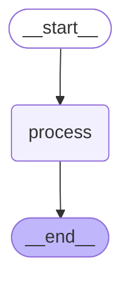
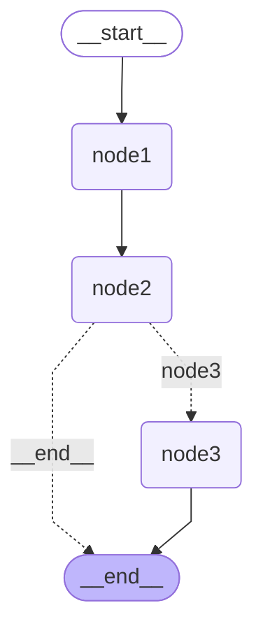
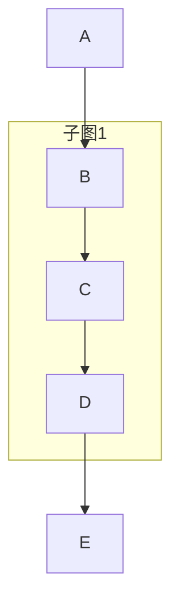
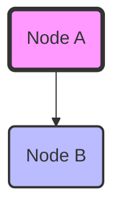
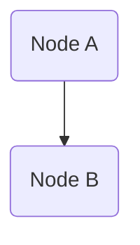
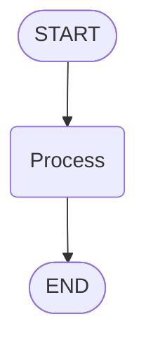

# 图可视化 - 核心概念7: Mermaid 语法基础

## 概念定位

**核心概念**: Mermaid 语法基础
**重要程度**: ⭐⭐⭐ (中)
**使用频率**: 中等
**难度等级**: ⭐⭐ (中等)

## 一句话定义

**Mermaid 是一种基于文本的图表描述语言,用于通过简单的文本语法生成流程图、序列图等可视化图表,是 LangGraph 图可视化的输出格式。**

## 详细解释

### Mermaid 简介

Mermaid 是一种流行的图表描述语言:
- **文本格式**: 使用简单的文本语法描述图表
- **易于版本控制**: 文本格式易于 git diff 和版本管理
- **广泛支持**: GitHub、GitLab、Markdown 编辑器等都支持
- **在线渲染**: 可以使用 Mermaid.ink API 渲染为图像

[来源: reference/context7_langgraph_01.md - Mermaid 语法基础]

### 基础语法

#### 1. 图类型声明

```mermaid
graph TD;  # TD = Top Down (从上到下)
```

**支持的图类型**:
- `graph TD`: 从上到下 (Top Down)
- `graph LR`: 从左到右 (Left Right)
- `graph BT`: 从下到上 (Bottom Top)
- `graph RL`: 从右到左 (Right Left)

**LangGraph 使用**: 默认使用 `graph TD`

#### 2. 节点定义

```mermaid
# 矩形节点
node1(Node 1)

# 圆角矩形节点
node2([Node 2])

# 菱形节点 (决策节点)
node3{Decision}

# 圆形节点
node4((Circle))

# 六边形节点
node5{{Hexagon}}
```

**LangGraph 使用**:
- START 节点: `__start__([<p>__start__</p>])`
- 普通节点: `node_name(node_name)`
- END 节点: `__end__([<p>__end__</p>])`

[来源: reference/context7_langgraph_01.md - Mermaid 语法基础]

#### 3. 边定义

```mermaid
# 普通边 (实线箭头)
A --> B

# 带标签的边
A -->|label| B

# 虚线边
A -.-> B

# 带标签的虚线边
A -.->|label| B

# 粗边
A ==> B

# 带标签的粗边
A ==>|label| B
```

**LangGraph 使用**:
- 普通边: `node1 --> node2;`
- 条件边: `node1 -.->|condition| node2;`

#### 4. 样式定义

```mermaid
# 定义样式类
classDef default fill:#f2f0ff,line-height:1.2
classDef first fill-opacity:0
classDef last fill:#bfb6fc

# 应用样式到节点
node1:::first
node2:::last
```

**LangGraph 使用**:
- `default`: 普通节点样式
- `first`: START 节点样式
- `last`: END 节点样式

### LangGraph 生成的 Mermaid 示例

#### 1. 简单图

```python
from langgraph.graph import StateGraph, START, END
from typing import TypedDict

class State(TypedDict):
    messages: list[str]

workflow = StateGraph(State)
workflow.add_node("process", lambda x: x)
workflow.add_edge(START, "process")
workflow.add_edge("process", END)

app = workflow.compile()
print(app.get_graph().draw_mermaid())
```

**输出**:


[来源: reference/context7_langgraph_01.md - 基础可视化模式]

#### 2. 条件边图

```python
workflow = StateGraph(State)
workflow.add_node("node1", lambda x: x)
workflow.add_node("node2", lambda x: x)
workflow.add_node("node3", lambda x: x)
workflow.add_edge(START, "node1")
workflow.add_edge("node1", "node2")
workflow.add_conditional_edges(
    "node2",
    lambda x: "node3" if x.get("condition") else END,
    {
        "node3": "node3",
        END: END
    }
)
workflow.add_edge("node3", END)

app = workflow.compile()
print(app.get_graph().draw_mermaid())
```

**输出**:


**关键点**:
- 条件边使用虚线箭头 (`-.->`)
- 条件边带有标签 (`|label|`)
- 普通边使用实线箭头 (`-->`)

[来源: reference/context7_langgraph_01.md - RAG 工作流可视化]

### Mermaid 初始化配置

```mermaid
%%{init: {'flowchart': {'curve': 'linear'}}}%%
```

**配置项**:
- `curve`: 边的曲线样式
  - `linear`: 直线 (默认)
  - `basis`: B样条曲线
  - `cardinal`: 基数样条曲线
  - `natural`: 自然曲线
  - `step`: 阶梯样式

**LangGraph 使用**: 默认使用 `linear`

### 实际应用场景

#### 场景1: 在 Markdown 中嵌入

```markdown
# 工作流文档

## 图结构


## 说明
...
```

**效果**: GitHub 和 GitLab 会自动渲染 Mermaid 代码块

[来源: reference/context7_langgraph_01.md - 文档生成场景]

#### 场景2: 使用在线编辑器

```python
# 生成 Mermaid 文本
mermaid_text = app.get_graph().draw_mermaid()

# 复制到在线编辑器
# https://mermaid.live/
# https://mermaid-js.github.io/mermaid-live-editor/
```

#### 场景3: 保存到文件

```python
# 保存 Mermaid 文本到文件
mermaid_text = app.get_graph().draw_mermaid()

with open("workflow.mmd", "w") as f:
    f.write(mermaid_text)

print("Mermaid 文本已保存到 workflow.mmd")
```

#### 场景4: 版本控制

```python
# 将 Mermaid 文本提交到 git
mermaid_text = app.get_graph().draw_mermaid(with_styles=False)

with open("docs/workflow.mmd", "w") as f:
    f.write(mermaid_text)

# git add docs/workflow.mmd
# git commit -m "Update workflow diagram"
# git diff 可以清晰看到图结构的变化
```

### 高级特性

#### 1. 子图 (Subgraph)



**LangGraph 使用**: 当 `xray=True` 时,子图会被展开为普通节点

#### 2. 样式定制



**LangGraph 使用**: 通过 `node_colors` 参数定制样式

#### 3. 链接



**LangGraph 使用**: 不支持链接

### 常见问题

#### Q1: 如何在 Jupyter 中渲染 Mermaid 文本?

**A**:
```python
from IPython.display import Markdown, display

mermaid_text = app.get_graph().draw_mermaid()

# 方法1: 使用 Markdown (需要 Jupyter 支持 Mermaid)
display(Markdown(f"""
```mermaid
{mermaid_text}
```
"""))

# 方法2: 使用 PNG 图像 (推荐)
from IPython.display import Image
display(Image(app.get_graph().draw_mermaid_png()))
```

#### Q2: 如何自定义 Mermaid 样式?

**A**:
```python
from langchain_core.runnables.graph import NodeStyles

# 自定义节点颜色
custom_colors = NodeStyles(
    default="#e0f7fa",
    first="#ffebee",
    last="#c8e6c9"
)

mermaid_text = app.get_graph().draw_mermaid(node_colors=custom_colors)
```

#### Q3: Mermaid 文本太长怎么办?

**A**:
- 使用 `xray=False` 只显示顶层结构
- 使用 `with_styles=False` 减少样式代码
- 拆分成多个子图分别可视化
- 使用在线编辑器查看 (支持缩放和导航)

#### Q4: 如何在 GitHub README 中显示?

**A**:
```markdown
# 项目文档

## 工作流图


```

GitHub 会自动渲染 Mermaid 代码块。

### Mermaid 语法速查表

#### 节点形状

| 语法 | 形状 | 示例 |
|------|------|------|
| `node(text)` | 矩形 | `A(Node A)` |
| `node([text])` | 圆角矩形 | `A([Start])` |
| `node{text}` | 菱形 | `A{Decision}` |
| `node((text))` | 圆形 | `A((Circle))` |
| `node{{text}}` | 六边形 | `A{{Hexagon}}` |

#### 边类型

| 语法 | 类型 | 示例 |
|------|------|------|
| `A --> B` | 实线箭头 | `A --> B` |
| `A -.-> B` | 虚线箭头 | `A -.-> B` |
| `A ==> B` | 粗箭头 | `A ==> B` |
| `A -->|text| B` | 带标签 | `A -->|label| B` |

#### 样式类

| 类名 | 用途 | LangGraph 使用 |
|------|------|----------------|
| `default` | 普通节点 | 所有普通节点 |
| `first` | 起始节点 | START 节点 |
| `last` | 结束节点 | END 节点 |

### 最佳实践

#### 1. 保持简洁

```python
# 使用 with_styles=False 减少代码
mermaid_text = app.get_graph().draw_mermaid(with_styles=False)
```

#### 2. 版本控制

```python
# 保存到 git,易于 diff
mermaid_text = app.get_graph().draw_mermaid(with_styles=False)
with open("docs/workflow.mmd", "w") as f:
    f.write(mermaid_text)
```

#### 3. 文档嵌入

```python
# 嵌入到 Markdown 文档
mermaid_text = app.get_graph().draw_mermaid()

markdown = f"""
# 工作流文档

```mermaid
{mermaid_text}
```
"""
```

#### 4. 在线编辑

```python
# 使用在线编辑器查看和编辑
# https://mermaid.live/
mermaid_text = app.get_graph().draw_mermaid()
print(mermaid_text)
```

### 总结

Mermaid 语法是 LangGraph 图可视化的核心输出格式:

1. **核心特性**: 文本格式,易于版本控制,广泛支持
2. **基础语法**: 图类型、节点、边、样式
3. **LangGraph 使用**: 生成标准的 Mermaid 流程图
4. **应用场景**: Markdown 嵌入、在线编辑、版本控制
5. **最佳实践**: 保持简洁、版本控制、文档嵌入

**记住**: Mermaid 是一种通用的图表描述语言,不仅用于 LangGraph,还可以用于其他场景的图表生成。

---

**版本**: v1.0
**最后更新**: 2026-02-25
**维护者**: Claude Code
**数据来源**: [reference/context7_langgraph_01.md, reference/context7_langchain_01.md]
