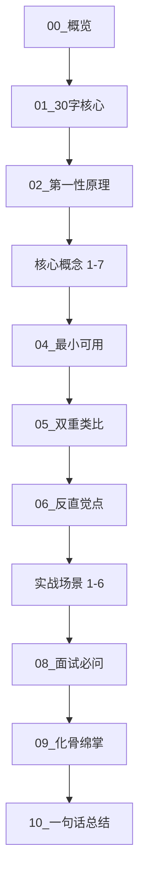

# OpenClaw 基础故障排查 - 概览

**知识点编号**: Phase1-06
**学习时长**: 2-3 小时
**难度等级**: ⭐⭐⭐ (中级)
**前置知识**: Phase1-01 至 Phase1-05

---

## 一、知识点定位

### 1.1 在学习路径中的位置

```
Phase 1: 快速上手与环境搭建
├── 01. OpenClaw 安装与配置 ✅
├── 02. Onboarding Wizard 详解 ✅
├── 03. CLI 基础命令 ✅
├── 04. Gateway 启动与管理 ✅
├── 05. 第一个消息发送 ✅
├── 06. 基础故障排查 ⬅️ 当前位置
├── 07. 开发环境搭建（从源码）
└── 08. 源码编译与调试
```

**为什么在这个位置？**
- 前面 5 个知识点让你能够运行 OpenClaw
- 现在你需要学会**当出现问题时如何诊断和修复**
- 这是从"能用"到"用好"的关键一步

### 1.2 核心价值

**这个知识点解决什么问题？**

当你遇到以下情况时，这个知识点能帮你：
- ❌ Gateway 无法启动
- ❌ 通道连接但消息不流动
- ❌ 不知道从哪里开始排查
- ❌ 看到错误消息不知道什么意思
- ❌ 修改配置后出现问题

**学完后你能做什么？**
- ✅ 60 秒内快速定位大部分问题
- ✅ 使用 `openclaw doctor` 自动修复常见问题
- ✅ 通过日志分析识别问题类型
- ✅ 理解 OpenClaw 的故障排查体系
- ✅ 独立解决 80% 的常见问题

---

## 二、知识点结构

### 2.1 核心概念（7个）

本知识点包含 7 个核心概念，每个概念都是独立完整的：

| 编号 | 核心概念 | 核心价值 | 学习时长 |
|------|---------|---------|---------|
| 1 | openclaw doctor 诊断工具 | 自动化健康检查和修复 | 20 分钟 |
| 2 | 日志系统与查看 | 实时跟踪和问题定位 | 15 分钟 |
| 3 | 网关状态检查 | Gateway 运行时监控 | 15 分钟 |
| 4 | 频道连接诊断 | 多通道故障排查 | 20 分钟 |
| 5 | 配置验证 | 配置文件验证和修复 | 15 分钟 |
| 6 | 常见错误类型 | 错误消息识别 | 15 分钟 |
| 7 | 自动修复机制 | 自动化修复流程 | 15 分钟 |

**总计**: 约 2 小时

### 2.2 实战场景（6个）

本知识点包含 6 个实战场景，每个场景都有完整的可运行代码：

| 编号 | 实战场景 | 解决的问题 | 学习时长 |
|------|---------|-----------|---------|
| 1 | 60秒快速诊断 | 标准化诊断流程 | 15 分钟 |
| 2 | 网关无法启动排查 | 端口、配置、权限问题 | 20 分钟 |
| 3 | 频道消息不流动排查 | 配对、权限、路由问题 | 20 分钟 |
| 4 | 日志分析实战 | 日志特征识别 | 15 分钟 |
| 5 | 配置验证与修复 | doctor 命令使用 | 15 分钟 |
| 6 | 生产环境故障排查 | 综合诊断 | 30 分钟 |

**总计**: 约 2 小时

---

## 三、学习路线图

### 3.1 推荐学习顺序



### 3.2 学习策略

**快速上手路径（1 小时）**：
1. 阅读 `01_30字核心.md` - 5 分钟
2. 阅读 `04_最小可用.md` - 15 分钟
3. 实战 `场景1_60秒快速诊断.md` - 15 分钟
4. 实战 `场景5_配置验证与修复.md` - 15 分钟
5. 阅读 `06_反直觉点.md` - 10 分钟

**完整学习路径（4-5 小时）**：
1. 按顺序阅读所有基础维度文档 - 1 小时
2. 深入学习 7 个核心概念 - 2 小时
3. 完成所有 6 个实战场景 - 2 小时
4. 复习 `09_化骨绵掌.md` - 30 分钟

**问题驱动路径（按需学习）**：
- 遇到 Gateway 启动问题 → 直接看 `场景2_网关无法启动排查.md`
- 遇到通道问题 → 直接看 `场景3_频道消息不流动排查.md`
- 不知道如何开始 → 直接看 `场景1_60秒快速诊断.md`

---

## 四、核心工具链

### 4.1 诊断命令速查

OpenClaw 提供了一套完整的诊断命令：

```bash
# 1. 快速状态检查
openclaw status                    # 快速摘要
openclaw status --all              # 完整报告（可分享）
openclaw status --deep             # 深度探测

# 2. 网关状态
openclaw gateway status            # 网关状态
openclaw gateway probe             # 网关探测

# 3. 健康检查和修复
openclaw doctor                    # 健康检查
openclaw doctor --repair           # 自动修复
openclaw doctor --deep             # 深度诊断

# 4. 通道诊断
openclaw channels status --probe   # 通道状态探测
openclaw pairing list <channel>    # 配对状态

# 5. 日志查看
openclaw logs --follow             # 实时日志
openclaw health --json             # 健康快照
```

**来源**: `reference/source_troubleshooting_main.md`

### 4.2 60秒诊断流程

这是 OpenClaw 官方推荐的标准化诊断流程：

```bash
# 按顺序运行这些命令
openclaw status
openclaw status --all
openclaw gateway probe
openclaw gateway status
openclaw doctor
openclaw channels status --probe
openclaw logs --follow
```

**预期输出**：
- `Runtime: running` ✅
- `RPC probe: ok` ✅
- 通道显示 `connected` 或 `ready` ✅
- 无重复致命错误 ✅

**来源**: `reference/source_troubleshooting_main.md`

---

## 五、故障决策树

### 5.1 问题分类

OpenClaw 的故障可以分为 7 大类：

```
OpenClaw 故障类型
├── 1. 无回复 (No replies)
├── 2. 控制面板无法连接 (Dashboard connectivity)
├── 3. 网关无法启动 (Gateway startup)
├── 4. 通道连接但消息不流动 (Channel flow)
├── 5. Cron/心跳未触发 (Automation)
├── 6. 节点工具失败 (Node tools)
└── 7. 浏览器工具失败 (Browser tools)
```

**来源**: `reference/source_troubleshooting_main.md`

### 5.2 快速定位表

| 症状 | 最可能的原因 | 快速检查命令 |
|------|------------|-------------|
| Gateway 无法启动 | 端口 18789 被占用 | `openclaw gateway status` |
| 通道连接但无回复 | 配对待定或提及门控 | `openclaw pairing list <channel>` |
| 认证失败 | token/password 不匹配 | `openclaw config get gateway.auth.token` |
| 配置错误 | 配置文件损坏 | `openclaw doctor --repair` |
| 日志中重复错误 | 网络不稳定或权限问题 | `openclaw logs --follow` |

**来源**: `reference/source_gateway_troubleshooting.md`

---

## 六、技术栈要求

### 6.1 环境要求

```json
{
  "runtime": {
    "nodejs": ">= 22.12.0",
    "packageManager": "pnpm@10.23.0"
  },
  "platform": {
    "supported": ["macOS", "Linux", "Windows (WSL2)"],
    "recommended": "macOS or Linux"
  },
  "resources": {
    "minRAM": "512MB-1GB",
    "minCPU": "1 core",
    "minDisk": "500MB"
  }
}
```

**来源**: `reference/source_package_info.md`

### 6.2 核心依赖

```typescript
// OpenClaw 核心依赖
{
  "@mariozechner/pi-agent-core": "0.54.0",  // Agent 系统
  "grammy": "^1.40.0",                       // Telegram
  "@whiskeysockets/baileys": "7.0.0-rc.9",  // WhatsApp
  "@slack/bolt": "^4.6.0",                   // Slack
  "discord-api-types": "^0.38.40",           // Discord
  "playwright-core": "1.58.2",               // 浏览器自动化
  "express": "^5.2.1",                       // Web 框架
  "ws": "^8.19.0",                           // WebSocket
  "tslog": "^4.10.2"                         // 日志系统
}
```

**来源**: `reference/source_package_info.md`

---

## 七、常见问题预览

### 7.1 最常见的 5 个问题

**1. 端口 18789 被占用**
```bash
# 症状
another gateway instance is already listening
EADDRINUSE

# 解决
openclaw gateway stop
openclaw gateway start
```

**2. 配对待定（pairing required）**
```bash
# 症状
pairing request in logs

# 解决
openclaw pairing list <channel>
openclaw pairing approve <channel> <sender>
```

**3. 提及门控（mention required）**
```bash
# 症状
drop guild message (mention required

# 解决
# 在群组中提及机器人，或修改配置
openclaw config set channels.<channel>.requireMention false
```

**4. 认证失败（unauthorized）**
```bash
# 症状
unauthorized / reconnect loop

# 解决
openclaw config get gateway.auth.token
openclaw doctor --repair
```

**5. 配置错误**
```bash
# 症状
Gateway start blocked: set gateway.mode=local

# 解决
openclaw config set gateway.mode local
openclaw gateway restart
```

**来源**: `reference/search_openclaw_troubleshooting.md`

### 7.2 社区资源

- **官方文档**: https://docs.openclaw.ai/gateway/troubleshooting
- **GitHub Issues**: https://github.com/openclaw/openclaw/issues
- **社区经验**: Medium, YouTube 教程
- **实时帮助**: Discord 社区

**来源**: `reference/search_openclaw_troubleshooting.md`

---

## 八、学习检查清单

### 8.1 基础知识检查

完成以下检查，确保你已掌握基础知识：

- [ ] 我知道 OpenClaw 的 60 秒诊断流程
- [ ] 我能使用 `openclaw doctor` 命令
- [ ] 我知道如何查看实时日志
- [ ] 我能识别常见的错误消息
- [ ] 我知道 Gateway 的端口是 18789
- [ ] 我了解配对机制（pairing）
- [ ] 我了解提及门控（mention gating）

### 8.2 实战能力检查

完成以下检查，确保你具备实战能力：

- [ ] 我能在 60 秒内定位大部分问题
- [ ] 我能使用 `openclaw doctor --repair` 修复配置
- [ ] 我能通过日志识别问题类型
- [ ] 我能解决端口冲突问题
- [ ] 我能解决通道连接问题
- [ ] 我能验证和修复配置文件
- [ ] 我能独立排查生产环境问题

### 8.3 进阶理解检查

完成以下检查，确保你深入理解了故障排查：

- [ ] 我理解 OpenClaw 的故障排查体系
- [ ] 我知道何时使用哪个诊断命令
- [ ] 我能区分不同类型的错误
- [ ] 我了解自动修复机制的原理
- [ ] 我能设计自己的诊断流程
- [ ] 我能帮助他人排查问题

---

## 九、下一步学习

### 9.1 后续知识点

完成本知识点后，建议继续学习：

1. **Phase1-07: 开发环境搭建（从源码）**
   - 从源码运行 OpenClaw
   - 开发模式和调试工具
   - 贡献代码的准备工作

2. **Phase1-08: 源码编译与调试**
   - 源码结构分析
   - 调试技术
   - 性能分析

3. **Phase2-09: Gateway 架构设计**
   - 深入理解 Gateway 架构
   - 消息路由机制
   - 扩展点设计

### 9.2 扩展阅读

**官方文档**：
- [Troubleshooting Guide](https://docs.openclaw.ai/gateway/troubleshooting)
- [Doctor Command](https://docs.openclaw.ai/cli/doctor)
- [Debugging Tools](https://docs.openclaw.ai/help/debugging)

**社区资源**：
- [Every OpenClaw Problem I Hit](https://medium.com/@tarangtattva2/every-openclaw-problem-i-hit-and-how-i-actually-fixed-them-fb394dc49d38)
- [OpenClaw Port Not Listening Guide](https://www.aifreeapi.com/en/posts/openclaw-port-not-listening)

**来源**: `reference/search_openclaw_troubleshooting.md`

---

## 十、学习建议

### 10.1 学习方法

**理论与实践结合**：
- 先阅读核心概念，理解原理
- 然后动手实践，运行实战代码
- 遇到问题时查阅相关章节
- 定期复习 `09_化骨绵掌.md`

**问题驱动学习**：
- 不要等到出现问题才学习
- 主动制造一些"问题"来练习
- 例如：故意停止 Gateway，然后练习诊断

**社区互动**：
- 在 Discord 社区提问
- 分享你的故障排查经验
- 帮助他人解决问题

### 10.2 常见误区

**误区 1**：只记命令，不理解原理
- ❌ 死记硬背诊断命令
- ✅ 理解每个命令的作用和原理

**误区 2**：遇到问题就重装
- ❌ 出现问题就重新安装
- ✅ 先诊断，找到根本原因

**误区 3**：忽略日志信息
- ❌ 不看日志，盲目尝试
- ✅ 仔细分析日志，识别特征

**误区 4**：不使用 doctor 命令
- ❌ 手动修改配置文件
- ✅ 优先使用 `openclaw doctor --repair`

---

## 十一、文档导航

### 11.1 本知识点文档列表

**基础维度**：
- `00_概览.md` ⬅️ 当前文档
- `01_30字核心.md` - 一句话核心定义
- `02_第一性原理.md` - 从根本问题出发
- `04_最小可用.md` - 20%核心知识
- `05_双重类比.md` - 后端开发 + 日常生活类比
- `06_反直觉点.md` - 3个常见误区
- `08_面试必问.md` - 高频面试问题
- `09_化骨绵掌.md` - 10个2分钟知识卡片
- `10_一句话总结.md` - 最终总结

**核心概念**（7个）：
- `03_核心概念_1_openclaw_doctor诊断工具.md`
- `03_核心概念_2_日志系统与查看.md`
- `03_核心概念_3_网关状态检查.md`
- `03_核心概念_4_频道连接诊断.md`
- `03_核心概念_5_配置验证.md`
- `03_核心概念_6_常见错误类型.md`
- `03_核心概念_7_自动修复机制.md`

**实战场景**（6个）：
- `07_实战代码_场景1_60秒快速诊断.md`
- `07_实战代码_场景2_网关无法启动排查.md`
- `07_实战代码_场景3_频道消息不流动排查.md`
- `07_实战代码_场景4_日志分析实战.md`
- `07_实战代码_场景5_配置验证与修复.md`
- `07_实战代码_场景6_生产环境故障排查.md`

### 11.2 参考资料

所有参考资料保存在 `reference/` 目录：
- `reference/INDEX.md` - 资料索引
- `reference/source_*.md` - 源码分析（7个文件）
- `reference/context7_libraries.md` - Context7 库信息
- `reference/search_*.md` - 网络搜索结果（2个文件）

---

**文档版本**: v1.0
**最后更新**: 2026-02-24
**维护者**: Claude Code
**基于**: OpenClaw 2026.2.22

**数据来源**：
- `reference/source_troubleshooting_main.md`
- `reference/source_gateway_troubleshooting.md`
- `reference/source_doctor_command.md`
- `reference/source_package_info.md`
- `reference/search_openclaw_troubleshooting.md`
