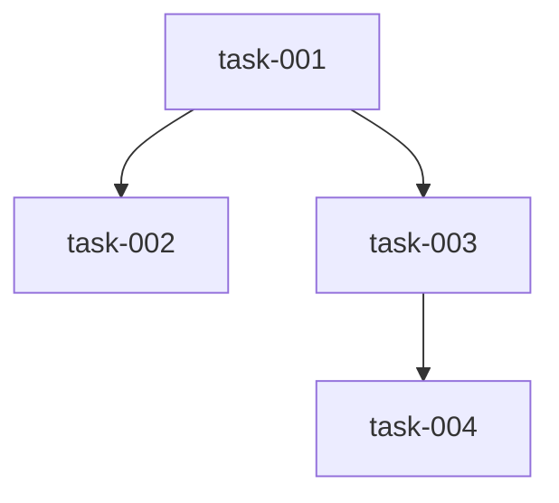
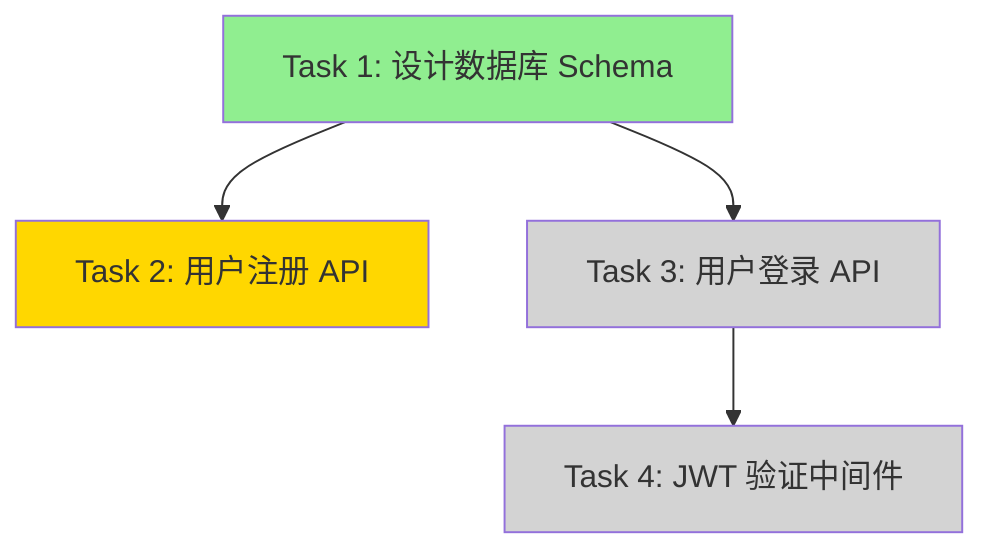

# 核心概念 01：Plan 表示与文件存储

> **核心理念：** 文件优先（File-First）是 pi-mono 的核心哲学，Plan 应该存储在文件中以实现最大可观察性。

---

## Plan 的本质

### 什么是 Plan？

Plan（计划）是对任务执行策略的结构化描述，包含：

1. **目标（Goal）**：要实现什么
2. **任务（Tasks）**：需要做哪些事
3. **依赖（Dependencies）**：任务之间的依赖关系
4. **上下文（Context）**：相关的背景信息
5. **决策（Decisions）**：为什么这样做

### Plan 的两种表示方式

| 方式 | 优势 | 劣势 | 适用场景 |
|------|------|------|----------|
| **JSON** | 结构化、易解析、类型安全 | 不易人工编辑、可读性差 | 程序处理、自动化 |
| **Markdown** | 可读性好、易编辑、支持富文本 | 解析复杂、结构松散 | 人工阅读、协作 |

---

## JSON 格式的 Plan

### 基本结构

```typescript
interface Plan {
  // 元数据
  id: string;
  createdAt: string;
  updatedAt: string;
  status: 'draft' | 'approved' | 'executing' | 'completed' | 'failed';

  // 核心内容
  goal: string;
  context: string;
  tasks: Task[];
  dependencies: Dependency[];

  // 执行信息
  currentTask?: string;
  completedTasks: string[];
  failedTasks: string[];

  // 元信息
  metadata: Record<string, any>;
}

interface Task {
  id: string;
  title: string;
  description: string;
  status: 'pending' | 'in_progress' | 'completed' | 'failed';
  dependencies: string[]; // Task IDs
  estimatedComplexity?: 'low' | 'medium' | 'high';
  actualDuration?: number;
  notes?: string;
}

interface Dependency {
  from: string; // Task ID
  to: string;   // Task ID
  type: 'blocks' | 'requires' | 'suggests';
}
```

### 完整示例

```json
{
  "id": "plan-20260221-001",
  "createdAt": "2026-02-21T10:00:00Z",
  "updatedAt": "2026-02-21T10:30:00Z",
  "status": "approved",

  "goal": "实现用户认证系统",
  "context": "当前系统没有认证机制，需要添加 JWT 认证",

  "tasks": [
    {
      "id": "task-001",
      "title": "设计数据库 Schema",
      "description": "创建 users 表，包含 id, email, password_hash, created_at",
      "status": "completed",
      "dependencies": [],
      "estimatedComplexity": "low",
      "actualDuration": 1800
    },
    {
      "id": "task-002",
      "title": "实现用户注册 API",
      "description": "POST /api/auth/register，接收 email 和 password",
      "status": "in_progress",
      "dependencies": ["task-001"],
      "estimatedComplexity": "medium"
    },
    {
      "id": "task-003",
      "title": "实现用户登录 API",
      "description": "POST /api/auth/login，返回 JWT token",
      "status": "pending",
      "dependencies": ["task-001"],
      "estimatedComplexity": "medium"
    },
    {
      "id": "task-004",
      "title": "实现 JWT 验证中间件",
      "description": "验证请求头中的 JWT token",
      "status": "pending",
      "dependencies": ["task-003"],
      "estimatedComplexity": "high"
    }
  ],

  "dependencies": [
    {
      "from": "task-001",
      "to": "task-002",
      "type": "blocks"
    },
    {
      "from": "task-001",
      "to": "task-003",
      "type": "blocks"
    },
    {
      "from": "task-003",
      "to": "task-004",
      "type": "requires"
    }
  ],

  "currentTask": "task-002",
  "completedTasks": ["task-001"],
  "failedTasks": [],

  "metadata": {
    "author": "pi-agent",
    "project": "auth-system",
    "priority": "high",
    "tags": ["authentication", "security", "jwt"]
  }
}
```

### JSON 格式的优势

1. **结构化**：严格的数据结构，易于验证
2. **可解析**：程序可以直接解析和处理
3. **类型安全**：配合 TypeScript 接口，类型安全
4. **易于查询**：可以用 jq 等工具查询
5. **版本控制友好**：Git diff 可以清晰显示变化

### JSON 格式的劣势

1. **可读性差**：人工阅读困难
2. **编辑不便**：需要注意语法，容易出错
3. **缺乏富文本**：无法使用 Markdown 格式化
4. **冗长**：包含大量结构化信息

---

## Markdown 格式的 Plan

### 基本结构

```markdown
# Plan: [Plan Title]

**ID**: plan-20260221-001
**Created**: 2026-02-21 10:00:00
**Status**: approved

## Goal

[Clear statement of what we want to achieve]

## Context

[Background information, constraints, assumptions]

## Tasks

### Task 1: [Task Title]
**ID**: task-001
**Status**: completed
**Dependencies**: none
**Complexity**: low

[Detailed description of the task]

**Notes**:
- [Any relevant notes]

### Task 2: [Task Title]
**ID**: task-002
**Status**: in_progress
**Dependencies**: task-001
**Complexity**: medium

[Detailed description of the task]

## Dependencies



## Execution Log

- [2026-02-21 10:00] Created plan
- [2026-02-21 10:15] Completed task-001
- [2026-02-21 10:30] Started task-002

## Metadata

- **Author**: pi-agent
- **Project**: auth-system
- **Priority**: high
- **Tags**: authentication, security, jwt
```

### 完整示例

```markdown
# Plan: 实现用户认证系统

**ID**: plan-20260221-001
**Created**: 2026-02-21 10:00:00
**Updated**: 2026-02-21 10:30:00
**Status**: approved

## Goal

实现一个基于 JWT 的用户认证系统，支持用户注册、登录和 token 验证。

## Context

当前系统没有认证机制，所有 API 都是公开的。需要添加认证系统以保护敏感数据。

**技术栈**:
- Backend: Node.js + Express
- Database: PostgreSQL
- Auth: JWT (jsonwebtoken)
- Password: bcrypt

**约束**:
- Token 有效期: 24 小时
- 密码最小长度: 8 字符
- 需要支持 refresh token

## Tasks

### Task 1: 设计数据库 Schema
**ID**: task-001
**Status**: ✅ completed
**Dependencies**: none
**Complexity**: low
**Duration**: 30 minutes

创建 `users` 表，包含以下字段：
- `id`: UUID, primary key
- `email`: VARCHAR(255), unique, not null
- `password_hash`: VARCHAR(255), not null
- `created_at`: TIMESTAMP, default now()
- `updated_at`: TIMESTAMP, default now()

**SQL**:
```sql
CREATE TABLE users (
  id UUID PRIMARY KEY DEFAULT gen_random_uuid(),
  email VARCHAR(255) UNIQUE NOT NULL,
  password_hash VARCHAR(255) NOT NULL,
  created_at TIMESTAMP DEFAULT NOW(),
  updated_at TIMESTAMP DEFAULT NOW()
);
```

**Notes**:
- 使用 UUID 而非自增 ID，更安全
- email 字段添加唯一索引
- 密码使用 bcrypt hash，不存储明文

---

### Task 2: 实现用户注册 API
**ID**: task-002
**Status**: 🔄 in_progress
**Dependencies**: task-001
**Complexity**: medium
**Estimated Duration**: 1 hour

实现 `POST /api/auth/register` 端点：

**Request**:
```json
{
  "email": "user@example.com",
  "password": "securepassword123"
}
```

**Response** (Success):
```json
{
  "success": true,
  "user": {
    "id": "uuid",
    "email": "user@example.com"
  }
}
```

**Response** (Error):
```json
{
  "success": false,
  "error": "Email already exists"
}
```

**Validation**:
- Email 格式验证
- 密码长度 >= 8
- Email 唯一性检查

**Implementation Steps**:
1. 创建 `src/routes/auth.ts`
2. 添加 email 验证中间件
3. 使用 bcrypt hash 密码
4. 插入数据库
5. 返回用户信息（不包含密码）

---

### Task 3: 实现用户登录 API
**ID**: task-003
**Status**: ⏳ pending
**Dependencies**: task-001
**Complexity**: medium
**Estimated Duration**: 1 hour

实现 `POST /api/auth/login` 端点：

**Request**:
```json
{
  "email": "user@example.com",
  "password": "securepassword123"
}
```

**Response** (Success):
```json
{
  "success": true,
  "token": "eyJhbGciOiJIUzI1NiIsInR5cCI6IkpXVCJ9...",
  "user": {
    "id": "uuid",
    "email": "user@example.com"
  }
}
```

**JWT Payload**:
```json
{
  "userId": "uuid",
  "email": "user@example.com",
  "iat": 1234567890,
  "exp": 1234654290
}
```

**Implementation Steps**:
1. 查询用户
2. 验证密码（bcrypt.compare）
3. 生成 JWT token
4. 返回 token 和用户信息

---

### Task 4: 实现 JWT 验证中间件
**ID**: task-004
**Status**: ⏳ pending
**Dependencies**: task-003
**Complexity**: high
**Estimated Duration**: 1.5 hours

实现 `authenticateToken` 中间件，验证请求头中的 JWT token。

**Usage**:
```typescript
app.get('/api/protected', authenticateToken, (req, res) => {
  // req.user 包含解码后的用户信息
  res.json({ message: 'Protected data', user: req.user });
});
```

**Implementation Steps**:
1. 从 `Authorization` header 提取 token
2. 验证 token 签名
3. 检查 token 是否过期
4. 将解码后的用户信息附加到 `req.user`
5. 处理各种错误情况

**Error Handling**:
- 401: Token missing
- 401: Token invalid
- 401: Token expired
- 403: Insufficient permissions

## Dependencies



**Legend**:
- 🟢 Green: Completed
- 🟡 Yellow: In Progress
- ⚪ Gray: Pending

## Execution Log

- **[2026-02-21 10:00]** Created plan
- **[2026-02-21 10:15]** Completed task-001 (设计数据库 Schema)
  - Created `users` table
  - Added indexes
- **[2026-02-21 10:30]** Started task-002 (用户注册 API)
  - Created `src/routes/auth.ts`
  - Implemented email validation

## Risks & Mitigation

| Risk | Impact | Mitigation |
|------|--------|------------|
| 密码存储不安全 | High | 使用 bcrypt，salt rounds >= 10 |
| JWT secret 泄露 | High | 使用环境变量，定期轮换 |
| Token 过期处理 | Medium | 实现 refresh token 机制 |
| SQL 注入 | High | 使用参数化查询 |

## Testing Strategy

1. **Unit Tests**:
   - Password hashing
   - JWT generation/verification
   - Email validation

2. **Integration Tests**:
   - Register flow
   - Login flow
   - Protected route access

3. **Security Tests**:
   - SQL injection attempts
   - XSS attempts
   - Brute force protection

## Metadata

- **Author**: pi-agent
- **Project**: auth-system
- **Priority**: high
- **Tags**: authentication, security, jwt, express, postgresql
- **Estimated Total Duration**: 4 hours
- **Actual Duration**: TBD
```

### Markdown 格式的优势

1. **可读性好**：人工阅读友好
2. **易于编辑**：任何文本编辑器都可以编辑
3. **富文本支持**：支持代码块、表格、图表
4. **协作友好**：团队成员可以直接编辑
5. **版本控制友好**：Git diff 清晰可读

### Markdown 格式的劣势

1. **结构松散**：没有严格的数据结构
2. **解析复杂**：需要自定义解析器
3. **类型不安全**：无法保证数据类型
4. **查询困难**：无法用工具直接查询

---

## 文件存储模式

### 模式 1：单文件存储

**结构**:
```
.pi/
└── plan.md  # 或 plan.json
```

**优势**:
- 简单直接
- 易于查找
- 适合小型项目

**劣势**:
- 只能存储一个计划
- 历史记录需要依赖 Git

**适用场景**:
- 简单任务
- 单人开发
- 快速原型

### 模式 2：多文件存储

**结构**:
```
.pi/plans/
├── plan-20260221-001.md
├── plan-20260221-002.md
└── plan-20260221-003.md
```

**优势**:
- 可以存储多个计划
- 历史记录清晰
- 易于管理

**劣势**:
- 需要管理文件命名
- 需要索引机制

**适用场景**:
- 复杂项目
- 多个并行任务
- 团队协作

### 模式 3：分层存储

**结构**:
```
.pi/
├── plans/
│   ├── active/
│   │   └── plan-current.md
│   ├── completed/
│   │   ├── plan-20260220-001.md
│   │   └── plan-20260220-002.md
│   └── archived/
│       └── plan-20260219-001.md
└── index.json  # 索引文件
```

**优势**:
- 清晰的状态管理
- 易于查找
- 支持归档

**劣势**:
- 结构复杂
- 需要维护索引

**适用场景**:
- 大型项目
- 长期维护
- 企业级应用

### 模式 4：混合存储

**结构**:
```
.pi/
├── plans/
│   ├── plan-20260221-001/
│   │   ├── plan.md          # 主计划文件
│   │   ├── metadata.json    # 元数据
│   │   ├── tasks/           # 任务详情
│   │   │   ├── task-001.md
│   │   │   └── task-002.md
│   │   └── logs/            # 执行日志
│   │       └── execution.log
│   └── plan-20260221-002/
│       └── ...
└── index.json
```

**优势**:
- 最大灵活性
- 支持复杂结构
- 易于扩展

**劣势**:
- 最复杂
- 需要完善的管理工具

**适用场景**:
- 超大型项目
- 复杂依赖关系
- 需要详细审计

---

## 文件命名规范

### 命名模式

```
plan-[date]-[sequence]-[optional-slug].md
```

**示例**:
```
plan-20260221-001-auth-system.md
plan-20260221-002-api-refactor.md
plan-20260221-003.md
```

### 命名规则

1. **前缀**: 统一使用 `plan-`
2. **日期**: YYYYMMDD 格式
3. **序号**: 3 位数字，从 001 开始
4. **Slug**: 可选，简短描述（kebab-case）
5. **扩展名**: `.md` 或 `.json`

---

## 文件读写操作

### 写入 Plan（TypeScript）

```typescript
import { writeFile } from 'fs/promises';
import { join } from 'path';

interface WritePlanOptions {
  format: 'json' | 'markdown';
  directory?: string;
}

async function writePlan(
  plan: Plan,
  options: WritePlanOptions = { format: 'markdown' }
): Promise<string> {
  const { format, directory = '.pi/plans' } = options;

  // 生成文件名
  const timestamp = new Date().toISOString().split('T')[0].replace(/-/g, '');
  const filename = `plan-${timestamp}-${plan.id}.${format === 'json' ? 'json' : 'md'}`;
  const filepath = join(directory, filename);

  // 生成内容
  const content = format === 'json'
    ? JSON.stringify(plan, null, 2)
    : convertPlanToMarkdown(plan);

  // 写入文件
  await writeFile(filepath, content, 'utf-8');

  return filepath;
}

function convertPlanToMarkdown(plan: Plan): string {
  return `# Plan: ${plan.goal}

**ID**: ${plan.id}
**Created**: ${plan.createdAt}
**Status**: ${plan.status}

## Goal

${plan.goal}

## Context

${plan.context}

## Tasks

${plan.tasks.map(task => `
### Task ${task.id}: ${task.title}
**Status**: ${task.status}
**Dependencies**: ${task.dependencies.join(', ') || 'none'}

${task.description}
`).join('\n')}

## Metadata

${Object.entries(plan.metadata).map(([key, value]) => `- **${key}**: ${value}`).join('\n')}
`;
}
```

### 读取 Plan（TypeScript）

```typescript
import { readFile } from 'fs/promises';

async function readPlan(filepath: string): Promise<Plan> {
  const content = await readFile(filepath, 'utf-8');

  if (filepath.endsWith('.json')) {
    return JSON.parse(content) as Plan;
  } else {
    return parseMarkdownPlan(content);
  }
}

function parseMarkdownPlan(content: string): Plan {
  // 简化的 Markdown 解析器
  const lines = content.split('\n');

  // 提取元数据
  const idMatch = content.match(/\*\*ID\*\*:\s*(.+)/);
  const statusMatch = content.match(/\*\*Status\*\*:\s*(.+)/);

  // 提取 Goal
  const goalMatch = content.match(/## Goal\n\n(.+)/);

  // 提取 Tasks（简化版）
  const tasks: Task[] = [];
  const taskMatches = content.matchAll(/### Task (.+?): (.+)/g);
  for (const match of taskMatches) {
    tasks.push({
      id: match[1],
      title: match[2],
      description: '',
      status: 'pending',
      dependencies: []
    });
  }

  return {
    id: idMatch?.[1] || '',
    createdAt: new Date().toISOString(),
    updatedAt: new Date().toISOString(),
    status: (statusMatch?.[1] as any) || 'draft',
    goal: goalMatch?.[1] || '',
    context: '',
    tasks,
    dependencies: [],
    completedTasks: [],
    failedTasks: [],
    metadata: {}
  };
}
```

---

## 最佳实践

### 1. 选择合适的格式

| 场景 | 推荐格式 | 原因 |
|------|---------|------|
| 人工阅读和编辑 | Markdown | 可读性好 |
| 程序自动处理 | JSON | 易解析 |
| 团队协作 | Markdown | 易于 review |
| 复杂依赖关系 | JSON | 结构化 |

### 2. 使用版本控制

```bash
# 将 .pi/ 目录纳入 Git
git add .pi/plans/
git commit -m "Add implementation plan for auth system"
```

### 3. 添加索引文件

```json
{
  "plans": [
    {
      "id": "plan-20260221-001",
      "file": "plans/plan-20260221-001-auth-system.md",
      "status": "in_progress",
      "createdAt": "2026-02-21T10:00:00Z"
    }
  ]
}
```

### 4. 定期归档

```bash
# 将完成的计划移到归档目录
mv .pi/plans/active/plan-*.md .pi/plans/completed/
```

### 5. 使用模板

创建 `.pi/templates/plan-template.md`:

```markdown
# Plan: [Title]

**ID**: [auto-generated]
**Created**: [auto-generated]
**Status**: draft

## Goal

[What do you want to achieve?]

## Context

[Background, constraints, assumptions]

## Tasks

### Task 1: [Title]
**Status**: pending
**Dependencies**: none

[Description]

## Metadata

- **Author**: [Your name]
- **Priority**: [low/medium/high]
```

---

## 参考资源

### 官方资源

- [Pi-mono GitHub](https://github.com/badlogic/pi-mono)
- [Extension API Documentation](https://github.com/badlogic/pi-mono/blob/main/packages/coding-agent/docs/extensions.md)

### 研究资料

- `temp/03_grok_pi_mono_extensions.md` - Pi-mono 扩展 API
- `temp/04_grok_pi_mono_examples.md` - Pi-mono 扩展示例

---

## 下一步

- **03_核心概念_02_Extension_API集成.md**：学习如何通过扩展 API 实现 Plan Mode
- **07_实战代码_01_文件式计划.md**：查看完整的文件式规划代码示例
