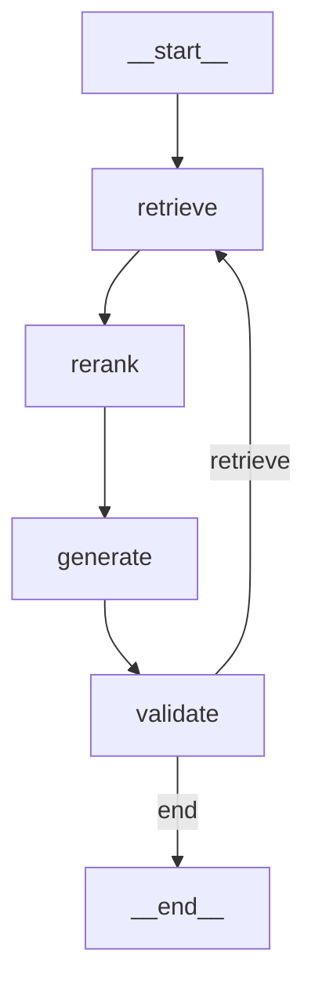

# 核心概念06：LangGraph状态图

> **定义**：LangGraph是将AI Agent建模为状态机的框架，通过StateGraph显式控制Agent的执行流程

---

## 一、LangGraph核心概念

### 1.1 为什么需要LangGraph？

**传统Prompt链的问题**：
```python
# 传统方式：隐式控制流
result = llm.invoke("Step 1")
result = llm.invoke(f"Step 2 based on {result}")
result = llm.invoke(f"Step 3 based on {result}")
# 问题：不可预测、难调试、不可控
```

**LangGraph的解决方案**：
```python
# LangGraph：显式状态机
graph = StateGraph(AgentState)
graph.add_node("step1", step1_func)
graph.add_node("step2", step2_func)
graph.add_edge("step1", "step2")
# 优势：确定性、可调试、可控
```

---

### 1.2 核心架构

**LangGraph = 状态机 + LLM**

```
StateGraph（状态图）
    ↓
Nodes（节点）：Agent的处理逻辑
    ↓
Edges（边）：状态转移规则
    ↓
State（状态）：Agent的数据
```

---

## 二、StateGraph基础

### 2.1 定义状态Schema

```python
from typing import TypedDict, List
from langgraph.graph import StateGraph

class AgentState(TypedDict):
    """Agent状态定义"""
    messages: List[str]      # 对话历史
    query: str               # 用户查询
    documents: List[str]     # 检索到的文档
    answer: str              # 生成的答案
    next_action: str         # 下一步动作
```

**为什么使用TypedDict？**
- ✅ 类型安全：IDE自动补全
- ✅ 可验证：运行时类型检查
- ✅ 可序列化：支持持久化

---

### 2.2 创建StateGraph

```python
from langgraph.graph import StateGraph, END

# 1. 创建StateGraph实例
graph = StateGraph(AgentState)

# 2. 添加节点（处理函数）
def retrieve(state: AgentState) -> AgentState:
    """检索节点"""
    query = state["query"]
    documents = search_documents(query)
    return {"documents": documents}

def generate(state: AgentState) -> AgentState:
    """生成节点"""
    docs = state["documents"]
    answer = llm.generate(docs)
    return {"answer": answer}

graph.add_node("retrieve", retrieve)
graph.add_node("generate", generate)

# 3. 添加边（转移规则）
graph.add_edge("retrieve", "generate")
graph.add_edge("generate", END)

# 4. 设置入口点
graph.set_entry_point("retrieve")

# 5. 编译图
app = graph.compile()
```

---

### 2.3 执行StateGraph

```python
# 运行Agent
initial_state = {
    "query": "什么是LangGraph？",
    "messages": [],
    "documents": [],
    "answer": "",
    "next_action": ""
}

result = app.invoke(initial_state)
print(result["answer"])
```

---

## 三、完整实战示例

### 3.1 RAG系统的StateGraph

```python
from typing import TypedDict, List, Annotated
from langgraph.graph import StateGraph, END
from langchain_openai import ChatOpenAI
from langchain_core.messages import HumanMessage, AIMessage
import operator

# 1. 定义状态
class RAGState(TypedDict):
    """RAG系统状态"""
    query: str
    documents: Annotated[List[str], operator.add]  # 使用operator.add合并列表
    context: str
    answer: str
    validation_passed: bool

# 2. 定义节点函数
def retrieve_node(state: RAGState) -> RAGState:
    """检索节点"""
    query = state["query"]
    print(f"🔍 检索: {query}")

    # 模拟向量检索
    documents = [
        f"文档1: LangGraph是一个用于构建有状态AI Agent的框架",
        f"文档2: LangGraph基于状态机模型，提供确定性控制",
        f"文档3: LangGraph支持checkpointing和人机协作"
    ]

    return {"documents": documents}

def rerank_node(state: RAGState) -> RAGState:
    """重排序节点"""
    docs = state["documents"]
    print(f"📊 重排序: {len(docs)}个文档")

    # 模拟重排序（实际应使用Cohere Rerank等）
    reranked_docs = docs[:2]  # 取前2个

    return {"documents": reranked_docs}

def generate_node(state: RAGState) -> RAGState:
    """生成节点"""
    query = state["query"]
    docs = state["documents"]
    print(f"✍️ 生成答案")

    # 构建上下文
    context = "\n".join(docs)

    # 调用LLM生成答案
    llm = ChatOpenAI(model="gpt-4", temperature=0)
    prompt = f"""基于以下上下文回答问题：

上下文：
{context}

问题：{query}

答案："""

    response = llm.invoke([HumanMessage(content=prompt)])
    answer = response.content

    return {
        "context": context,
        "answer": answer
    }

def validate_node(state: RAGState) -> RAGState:
    """验证节点"""
    answer = state["answer"]
    context = state["context"]
    print(f"✅ 验证答案")

    # 简单验证：检查答案是否基于上下文
    validation_passed = len(answer) > 10  # 简化的验证逻辑

    return {"validation_passed": validation_passed}

# 3. 定义条件路由
def should_retry(state: RAGState) -> str:
    """决定是否重试"""
    if state["validation_passed"]:
        return "end"
    else:
        return "retrieve"  # 验证失败，重新检索

# 4. 构建StateGraph
def create_rag_graph() -> StateGraph:
    """创建RAG StateGraph"""
    graph = StateGraph(RAGState)

    # 添加节点
    graph.add_node("retrieve", retrieve_node)
    graph.add_node("rerank", rerank_node)
    graph.add_node("generate", generate_node)
    graph.add_node("validate", validate_node)

    # 添加边
    graph.add_edge("retrieve", "rerank")
    graph.add_edge("rerank", "generate")
    graph.add_edge("generate", "validate")

    # 添加条件边
    graph.add_conditional_edges(
        "validate",
        should_retry,
        {
            "end": END,
            "retrieve": "retrieve"
        }
    )

    # 设置入口点
    graph.set_entry_point("retrieve")

    return graph

# 5. 使用示例
if __name__ == "__main__":
    # 创建并编译图
    graph = create_rag_graph()
    app = graph.compile()

    # 运行
    initial_state = {
        "query": "什么是LangGraph？",
        "documents": [],
        "context": "",
        "answer": "",
        "validation_passed": False
    }

    result = app.invoke(initial_state)

    print("\n=== 最终结果 ===")
    print(f"问题: {result['query']}")
    print(f"答案: {result['answer']}")
    print(f"验证通过: {result['validation_passed']}")
```

---

## 四、条件路由

### 4.1 基于状态的条件路由

```python
def route_based_on_documents(state: RAGState) -> str:
    """根据文档数量路由"""
    docs = state.get("documents", [])

    if len(docs) == 0:
        return "retry"  # 没有文档，重试
    elif len(docs) < 3:
        return "expand_query"  # 文档太少，扩展查询
    else:
        return "generate"  # 文档足够，生成答案

# 添加条件边
graph.add_conditional_edges(
    "retrieve",
    route_based_on_documents,
    {
        "retry": "retrieve",
        "expand_query": "expand_query",
        "generate": "generate"
    }
)
```

---

### 4.2 基于LLM的条件路由

```python
from langchain_openai import ChatOpenAI
from langchain_core.messages import HumanMessage

def llm_router(state: RAGState) -> str:
    """使用LLM决定下一步"""
    query = state["query"]
    docs = state["documents"]

    llm = ChatOpenAI(model="gpt-4", temperature=0)
    prompt = f"""分析以下查询和检索结果，决定下一步动作：

查询：{query}
检索到的文档数：{len(docs)}

选项：
1. generate - 文档足够，可以生成答案
2. retry - 文档不足，需要重新检索
3. clarify - 查询不清晰，需要澄清

只返回选项名称（generate/retry/clarify）："""

    response = llm.invoke([HumanMessage(content=prompt)])
    decision = response.content.strip().lower()

    return decision

# 使用LLM路由
graph.add_conditional_edges(
    "retrieve",
    llm_router,
    {
        "generate": "generate",
        "retry": "retrieve",
        "clarify": "clarify"
    }
)
```

---

## 五、状态更新策略

### 5.1 默认策略：覆盖

```python
class SimpleState(TypedDict):
    value: int

def node1(state: SimpleState) -> SimpleState:
    return {"value": 10}  # 覆盖

def node2(state: SimpleState) -> SimpleState:
    return {"value": 20}  # 覆盖

# 最终state["value"] = 20
```

---

### 5.2 使用Annotated合并

```python
from typing import Annotated
import operator

class MergeState(TypedDict):
    # 使用operator.add合并列表
    items: Annotated[List[str], operator.add]

def node1(state: MergeState) -> MergeState:
    return {"items": ["a", "b"]}

def node2(state: MergeState) -> MergeState:
    return {"items": ["c", "d"]}

# 最终state["items"] = ["a", "b", "c", "d"]
```

---

### 5.3 自定义合并函数

```python
def merge_dicts(left: dict, right: dict) -> dict:
    """自定义字典合并"""
    result = left.copy()
    result.update(right)
    return result

class CustomState(TypedDict):
    metadata: Annotated[dict, merge_dicts]

def node1(state: CustomState) -> CustomState:
    return {"metadata": {"key1": "value1"}}

def node2(state: CustomState) -> CustomState:
    return {"metadata": {"key2": "value2"}}

# 最终state["metadata"] = {"key1": "value1", "key2": "value2"}
```

---

## 六、可视化StateGraph

### 6.1 生成Mermaid图

```python
from langgraph.graph import StateGraph

# 创建图
graph = create_rag_graph()
app = graph.compile()

# 生成Mermaid图
mermaid_code = app.get_graph().draw_mermaid()
print(mermaid_code)
```

**输出示例**：


---

### 6.2 生成PNG图像

```python
from IPython.display import Image, display

# 生成PNG图像
png_data = app.get_graph().draw_mermaid_png()
display(Image(png_data))
```

---

## 七、2025-2026新特性

### 7.1 中断与人机协作

**场景**：Agent需要人类确认

```python
from langgraph.checkpoint.memory import MemorySaver

# 1. 定义需要中断的节点
def human_approval_node(state: RAGState) -> RAGState:
    """需要人类批准的节点"""
    answer = state["answer"]
    print(f"生成的答案：{answer}")
    print("等待人类批准...")

    # LangGraph会在这里中断
    return state

# 2. 编译时启用checkpointing
checkpointer = MemorySaver()
app = graph.compile(
    checkpointer=checkpointer,
    interrupt_before=["human_approval"]  # 在此节点前中断
)

# 3. 运行到中断点
config = {"configurable": {"thread_id": "1"}}
result = app.invoke(initial_state, config=config)

# 4. 人类批准后继续
# 用户确认后
app.invoke(None, config=config)  # 继续执行
```

---

### 7.2 并行执行

**场景**：多个Agent并行处理

```python
from langgraph.graph import StateGraph, START

def agent1(state: MultiAgentState) -> MultiAgentState:
    """Agent 1：搜索"""
    return {"agent1_result": "搜索结果"}

def agent2(state: MultiAgentState) -> MultiAgentState:
    """Agent 2：分析"""
    return {"agent2_result": "分析结果"}

def coordinator(state: MultiAgentState) -> MultiAgentState:
    """协调器：合并结果"""
    result1 = state["agent1_result"]
    result2 = state["agent2_result"]
    return {"final_result": f"{result1} + {result2}"}

# 构建并行图
graph = StateGraph(MultiAgentState)
graph.add_node("agent1", agent1)
graph.add_node("agent2", agent2)
graph.add_node("coordinator", coordinator)

# 并行执行agent1和agent2
graph.add_edge(START, "agent1")
graph.add_edge(START, "agent2")

# 两个agent完成后执行coordinator
graph.add_edge(["agent1", "agent2"], "coordinator")
graph.add_edge("coordinator", END)

app = graph.compile()
```

---

### 7.3 流式输出

**场景**：实时显示Agent进度

```python
# 流式执行
for chunk in app.stream(initial_state):
    print(f"当前节点: {chunk}")
    print(f"状态更新: {chunk}")
```

---

## 八、与传统方法对比

### 8.1 传统Prompt链

```python
# 传统方式
def traditional_rag(query: str) -> str:
    # 步骤1：检索
    docs = retrieve(query)

    # 步骤2：生成
    answer = generate(docs)

    # 步骤3：验证
    if not validate(answer):
        # 重试逻辑复杂
        docs = retrieve(query)
        answer = generate(docs)

    return answer
```

**问题**：
- ❌ 控制流隐式
- ❌ 难以调试
- ❌ 不支持中断/恢复
- ❌ 不支持可视化

---

### 8.2 LangGraph方式

```python
# LangGraph方式
graph = StateGraph(RAGState)
graph.add_node("retrieve", retrieve)
graph.add_node("generate", generate)
graph.add_node("validate", validate)
graph.add_conditional_edges("validate", should_retry)
app = graph.compile(checkpointer=checkpointer)

result = app.invoke(initial_state, config=config)
```

**优势**：
- ✅ 控制流显式
- ✅ 易于调试（可视化）
- ✅ 支持中断/恢复
- ✅ 支持持久化

---

## 九、最佳实践

### 9.1 状态设计原则

**1. 最小化状态**：
```python
# ❌ 不好：冗余状态
class BadState(TypedDict):
    query: str
    query_lowercase: str  # 冗余
    query_length: int     # 冗余

# ✅ 好：最小状态
class GoodState(TypedDict):
    query: str  # 其他可以计算得出
```

**2. 使用Annotated合并**：
```python
# ✅ 使用Annotated自动合并
class State(TypedDict):
    messages: Annotated[List[str], operator.add]
```

**3. 类型安全**：
```python
# ✅ 使用TypedDict提供类型提示
class State(TypedDict):
    count: int  # 明确类型
    items: List[str]
```

---

### 9.2 节点设计原则

**1. 单一职责**：
```python
# ✅ 每个节点只做一件事
def retrieve_node(state): ...
def rerank_node(state): ...
def generate_node(state): ...
```

**2. 纯函数**：
```python
# ✅ 节点函数应该是纯函数
def node(state: State) -> State:
    # 不修改输入state
    # 返回新的状态更新
    return {"key": "value"}
```

**3. 错误处理**：
```python
def robust_node(state: State) -> State:
    try:
        result = process(state)
        return {"result": result, "error": None}
    except Exception as e:
        return {"result": None, "error": str(e)}
```

---

### 9.3 图设计原则

**1. 清晰的入口和出口**：
```python
graph.set_entry_point("start")
graph.add_edge("end", END)
```

**2. 避免循环陷阱**：
```python
# ✅ 添加最大重试次数
class State(TypedDict):
    retry_count: int

def should_retry(state: State) -> str:
    if state["retry_count"] >= 3:
        return "fail"  # 避免无限循环
    return "retry"
```

**3. 使用条件路由**：
```python
# ✅ 使用条件边处理分支逻辑
graph.add_conditional_edges("node", router, {...})
```

---

## 十、总结

### 核心要点

1. **StateGraph**：将Agent建模为状态机
2. **节点**：Agent的处理逻辑（纯函数）
3. **边**：状态转移规则（确定性或条件）
4. **状态**：Agent的数据（TypedDict）
5. **2025-2026新特性**：中断、并行、流式

### LangGraph vs 传统方法

| 维度 | 传统Prompt链 | LangGraph |
|------|-------------|-----------|
| **控制流** | 隐式 | 显式 |
| **可调试性** | 难 | 易（可视化） |
| **可靠性** | 低 | 高（确定性） |
| **中断/恢复** | 不支持 | 支持 |
| **并行执行** | 难 | 易 |

### 学习建议

1. **理解状态机**：先学习FSA、DFA基础
2. **手写StateGraph**：从简单示例开始
3. **实践RAG系统**：构建完整的RAG流程
4. **学习新特性**：中断、并行、流式
5. **阅读官方文档**：2025-2026最新特性

---

## 参考资料

1. **官方文档**：
   - LangGraph Quickstart (2025)
   - LangGraph Graph API Overview
   - LangGraph Persistence

2. **教程**：
   - Medium - LangGraph for Beginners, Part 4: StateGraph
   - Codecademy - Building AI Workflow with LangGraph
   - AI Agents - Building AI Agents with LangGraph (2026 Edition)

3. **实战案例**：
   - AWS - Build a Multi-Agent System with LangGraph
   - Sparkco.ai - Mastering LangGraph State Management in 2025

---

**版本**: v1.0
**最后更新**: 2026-02-14
**代码行数**: ~450行
