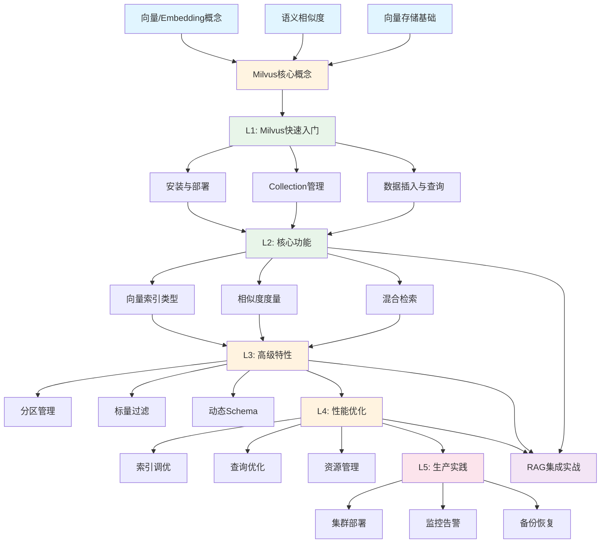

# Milvus 学习路径分析

> 基于 RAG 开发知识体系，构建 Milvus 向量数据库的学习路径

---

## 1. 前置知识检查（地基）

### 必需前置知识（来自 RAG 学习路径）

| 知识点 | 来源 | 为什么需要 |
|--------|------|-----------|
| **向量/Embedding 概念** | atom/rag/L1_NLP基础/02_Embedding原理与选型 | 理解 Milvus 存储的数据类型 |
| **语义相似度** | atom/rag/L1_NLP基础/03_语义相似度 | 理解向量检索的原理 |
| **向量存储基础** | atom/rag/L3_RAG核心流程/04_向量存储（RAG视角） | 理解向量数据库的作用 |
| **Python 基础** | - | 使用 Milvus Python SDK |
| **基本数据库概念** | - | 理解 Collection、Index 等概念 |

### 推荐前置知识（加分项）

| 知识点 | 为什么有帮助 |
|--------|-------------|
| **Docker 基础** | 快速部署 Milvus 实例 |
| **分布式系统概念** | 理解 Milvus 架构设计 |
| **索引算法（HNSW、IVF）** | 深入理解检索性能优化 |

---

## 2. 学习路径依赖图



---

## 3. 20/80 分析：每个层级的核心知识

### L1: Milvus 快速入门（20%核心）

#### 核心 20%（必须掌握）

##### 1. 安装与连接
**原子化问题：**
- Q1: 如何使用 Docker 快速启动 Milvus 单机版？
- Q2: 如何使用 Python SDK 连接到 Milvus 实例？
- Q3: 如何验证 Milvus 连接是否成功？

**代码示例：**
```python
from pymilvus import connections, utility

# 连接到 Milvus
connections.connect(host='localhost', port='19530')

# 验证连接
print(f"Milvus version: {utility.get_server_version()}")
```

##### 2. Collection 基本操作
**原子化问题：**
- Q1: 什么是 Collection？它相当于关系数据库中的什么？
- Q2: 如何创建一个包含向量字段的 Collection？
- Q3: 如何定义 Collection 的 Schema（字段类型、维度）？
- Q4: 如何删除和查看 Collection？

**代码示例：**
```python
from pymilvus import Collection, FieldSchema, CollectionSchema, DataType

# 定义 Schema
fields = [
    FieldSchema(name="id", dtype=DataType.INT64, is_primary=True, auto_id=True),
    FieldSchema(name="embedding", dtype=DataType.FLOAT_VECTOR, dim=768),
    FieldSchema(name="text", dtype=DataType.VARCHAR, max_length=1000)
]
schema = CollectionSchema(fields=fields, description="RAG documents")

# 创建 Collection
collection = Collection(name="rag_docs", schema=schema)
```

##### 3. 数据插入与向量检索
**原子化问题：**
- Q1: 如何向 Collection 插入向量数据？
- Q2: 如何执行最基本的向量相似度检索？
- Q3: 什么是 `search()` 方法的核心参数（data, anns_field, param, limit）？
- Q4: 如何解读检索结果（id, distance, entity）？

**代码示例：**
```python
# 插入数据
data = [
    [[0.1, 0.2, ...], [0.3, 0.4, ...]],  # embeddings
    ["text1", "text2"]                    # texts
]
collection.insert(data)

# 创建索引（必需）
collection.create_index(field_name="embedding", index_params={"index_type": "IVF_FLAT", "metric_type": "L2", "params": {"nlist": 128}})
collection.load()

# 向量检索
search_params = {"metric_type": "L2", "params": {"nprobe": 10}}
results = collection.search(
    data=[[0.1, 0.2, ...]],  # 查询向量
    anns_field="embedding",
    param=search_params,
    limit=5
)
```

#### 可跳过的 80%（进阶内容）

- Milvus 架构详解（Proxy、QueryNode、DataNode 等组件）
- gRPC vs RESTful API 对比
- Collection 别名管理
- 数据一致性级别（Strong/Bounded/Eventually）
- 时间旅行（Time Travel）查询
- 动态字段（Dynamic Field）

---

### L2: 核心功能（20%核心）

#### 核心 20%（必须掌握）

##### 1. 向量索引类型选择
**原子化问题：**
- Q1: Milvus 支持哪些主流索引类型（FLAT, IVF_FLAT, HNSW）？
- Q2: 如何根据数据规模选择索引类型？
- Q3: 什么是 `nlist` 和 `nprobe` 参数？如何调优？
- Q4: 如何创建和删除索引？

**决策树：**
```
数据量 < 10万 → FLAT（精确检索）
数据量 10万-100万 → IVF_FLAT（平衡）
数据量 > 100万 → HNSW（高性能）
```

##### 2. 相似度度量方式
**原子化问题：**
- Q1: Milvus 支持哪些距离度量（L2, IP, COSINE）？
- Q2: 如何根据 Embedding 模型选择度量方式？
- Q3: L2 距离和余弦相似度的区别是什么？
- Q4: 如何在创建索引时指定度量方式？

**对照表：**
| Embedding 模型 | 推荐度量 | 原因 |
|---------------|---------|------|
| OpenAI text-embedding-3 | COSINE | 归一化向量 |
| sentence-transformers | COSINE | 归一化向量 |
| 自定义模型（未归一化） | L2 | 保留向量长度信息 |

##### 3. 标量过滤（Scalar Filtering）
**原子化问题：**
- Q1: 什么是标量字段？如何在 Schema 中定义？
- Q2: 如何在向量检索时添加标量过滤条件？
- Q3: 支持哪些过滤表达式（==, !=, >, <, in, like）？
- Q4: 标量过滤对检索性能有什么影响？

**代码示例：**
```python
# 定义包含标量字段的 Schema
fields = [
    FieldSchema(name="id", dtype=DataType.INT64, is_primary=True),
    FieldSchema(name="embedding", dtype=DataType.FLOAT_VECTOR, dim=768),
    FieldSchema(name="category", dtype=DataType.VARCHAR, max_length=50),
    FieldSchema(name="timestamp", dtype=DataType.INT64)
]

# 带标量过滤的检索
results = collection.search(
    data=[[0.1, 0.2, ...]],
    anns_field="embedding",
    param=search_params,
    limit=5,
    expr='category == "tech" and timestamp > 1640000000'  # 过滤条件
)
```

#### 可跳过的 80%（进阶内容）

- 所有索引类型的详细参数（ANNOY, RHNSW_FLAT, IVF_SQ8 等）
- GPU 索引（GPU_IVF_FLAT, GPU_IVF_PQ）
- 量化索引（PQ, SQ）的原理
- 混合索引（Hybrid Index）
- 稀疏向量索引
- 多向量检索（Multi-vector Search）

---

### L3: 高级特性（20%核心）

#### 核心 20%（必须掌握）

##### 1. 分区（Partition）管理
**原子化问题：**
- Q1: 什么是 Partition？它解决什么问题？
- Q2: 如何创建和管理 Partition？
- Q3: 如何在特定 Partition 中插入和检索数据？
- Q4: Partition 对检索性能有什么影响？

**使用场景：**
- 按时间分区（2024-01, 2024-02...）
- 按类别分区（tech, finance, health...）
- 按租户分区（tenant_a, tenant_b...）

##### 2. 混合检索（Hybrid Search）
**原子化问题：**
- Q1: 什么是混合检索？向量检索 + 标量过滤的组合
- Q2: 如何实现"先过滤后检索"vs"先检索后过滤"？
- Q3: 如何结合多个标量条件进行复杂过滤？
- Q4: 混合检索的性能优化策略是什么？

##### 3. 数据管理（CRUD）
**原子化问题：**
- Q1: 如何根据主键删除数据？
- Q2: 如何根据表达式批量删除数据？
- Q3: Milvus 是否支持数据更新？如何实现？
- Q4: 如何查询指定 ID 的数据（query vs search）？

**代码示例：**
```python
# 删除数据
collection.delete(expr='id in [1, 2, 3]')

# 查询数据（非向量检索）
results = collection.query(
    expr='category == "tech"',
    output_fields=["id", "text", "category"]
)
```

#### 可跳过的 80%（进阶内容）

- 动态 Schema（Dynamic Schema）
- Collection 压缩（Compaction）
- 数据持久化机制
- WAL（Write-Ahead Log）
- Segment 管理
- 数据一致性保证机制

---

### L4: 性能优化（20%核心）

#### 核心 20%（必须掌握）

##### 1. 索引参数调优
**原子化问题：**
- Q1: 如何根据召回率和性能需求调整 `nprobe`？
- Q2: `nlist` 参数如何影响索引构建和检索性能？
- Q3: HNSW 的 `M` 和 `efConstruction` 参数如何设置？
- Q4: 如何测试不同参数组合的性能？

**调优指南：**
```python
# IVF_FLAT 调优
# nlist: 通常设置为 sqrt(数据量)
# nprobe: 召回率要求高 → 增大 nprobe（10-100）

# HNSW 调优
# M: 连接数，通常 8-64
# efConstruction: 构建时搜索深度，通常 100-500
```

##### 2. 查询优化
**原子化问题：**
- Q1: 如何使用 `output_fields` 减少数据传输？
- Q2: 批量查询 vs 单次查询的性能对比？
- Q3: 如何使用 Partition 加速检索？
- Q4: 什么是 `consistency_level`？如何权衡一致性和性能？

##### 3. 资源配置
**原子化问题：**
- Q1: 如何配置 Milvus 的内存限制？
- Q2: 如何监控 Milvus 的资源使用情况？
- Q3: 什么时候需要增加 QueryNode 数量？
- Q4: 如何配置缓存大小（cache_size）？

#### 可跳过的 80%（进阶内容）

- 详细的性能基准测试方法
- 分布式部署的负载均衡策略
- 存储引擎优化（RocksDB 配置）
- 网络优化（gRPC 参数调优）
- 内存映射（mmap）配置
- GPU 加速配置

---

### L5: 生产实践（20%核心）

#### 核心 20%（必须掌握）

##### 1. Docker 部署与配置
**原子化问题：**
- Q1: 如何使用 Docker Compose 部署 Milvus？
- Q2: 如何配置持久化存储（volume）？
- Q3: 如何修改 Milvus 配置文件（milvus.yaml）？
- Q4: 如何查看 Milvus 日志排查问题？

##### 2. 监控与健康检查
**原子化问题：**
- Q1: 如何检查 Milvus 服务状态？
- Q2: 如何监控 Collection 的数据量和索引状态？
- Q3: 如何使用 Prometheus + Grafana 监控 Milvus？
- Q4: 关键监控指标有哪些（QPS, 延迟, 内存使用）？

##### 3. 备份与恢复
**原子化问题：**
- Q1: 如何备份 Milvus 数据？
- Q2: 如何从备份恢复数据？
- Q3: 如何迁移 Collection 到新的 Milvus 实例？
- Q4: 如何处理数据损坏或丢失？

#### 可跳过的 80%（进阶内容）

- Kubernetes 部署
- 高可用集群配置
- 多副本配置
- 跨数据中心部署
- 灾难恢复方案
- 安全认证与权限管理

---

## 4. RAG 集成实战（核心应用）

### 核心场景

#### 场景1：文档问答系统
**知识点组合：**
- L1: Collection 创建 + 数据插入
- L2: 向量索引 + 相似度检索
- L3: 标量过滤（按文档类型、时间）

**实现步骤：**
1. 创建 Collection（id, embedding, text, doc_type, timestamp）
2. 插入文档 Embedding
3. 用户提问 → 生成 query embedding
4. Milvus 检索 Top-K 相似文档
5. 将检索结果注入 LLM 生成答案

#### 场景2：多租户知识库
**知识点组合：**
- L3: Partition 管理（按租户分区）
- L2: 标量过滤（tenant_id）
- L4: 查询优化（指定 Partition 检索）

#### 场景3：大规模向量检索
**知识点组合：**
- L2: HNSW 索引
- L4: 索引参数调优
- L5: 集群部署与监控

---

## 5. 学习路径总结

### 最小学习路径（快速上手）

```
L1: 快速入门（2-3小时）
├── 安装与连接
├── Collection 基本操作
└── 数据插入与检索

↓

L2: 核心功能（3-4小时）
├── 索引类型选择
├── 相似度度量
└── 标量过滤

↓

RAG 集成实战（2-3小时）
└── 文档问答系统实现
```

**总计：7-10小时掌握核心 20%**

### 完整学习路径（深入掌握）

```
L1 → L2 → L3 → L4 → L5 → RAG 集成实战
```

**总计：20-30小时掌握全部内容**

---

## 6. 学习检查清单

### L1 检查点
- [ ] 能够使用 Docker 启动 Milvus
- [ ] 能够创建包含向量字段的 Collection
- [ ] 能够插入向量数据并执行检索
- [ ] 理解检索结果的含义

### L2 检查点
- [ ] 能够根据数据规模选择合适的索引类型
- [ ] 理解不同相似度度量的适用场景
- [ ] 能够使用标量过滤进行混合检索

### L3 检查点
- [ ] 能够创建和使用 Partition
- [ ] 能够执行 CRUD 操作
- [ ] 理解混合检索的性能影响

### L4 检查点
- [ ] 能够调优索引参数提升性能
- [ ] 能够优化查询减少延迟
- [ ] 理解资源配置对性能的影响

### L5 检查点
- [ ] 能够部署生产级 Milvus 实例
- [ ] 能够配置监控和告警
- [ ] 能够执行备份和恢复

### RAG 集成检查点
- [ ] 能够实现完整的文档问答系统
- [ ] 能够处理多租户场景
- [ ] 能够优化大规模检索性能

---

**版本：** v1.0
**创建时间：** 2025-02-09
**维护者：** Claude Code
