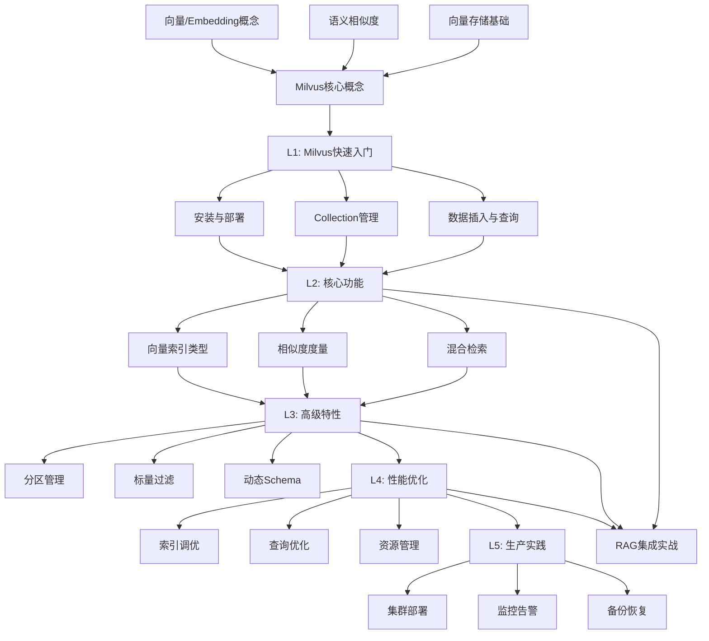

# 项目重构总结

> 原子化知识点体系重构 - 支持多领域学习路径

**重构日期：** 2025-02-09
**版本：** v3.0

---

## 🎯 重构目标

1. ✅ 提取通用模板，支持多领域知识点生成
2. ✅ 分离 RAG 和 Milvus 学习路径
3. ✅ 创建 Milvus 完整学习体系（前置知识 + 依赖图 + 20/80分析）
4. ✅ 保持原有 RAG 内容完整性

---

## 📁 新目录结构

```
vibe-learning-rag/
├── CLAUDE.md                          # RAG 开发专用配置
├── CLAUDE_MILVUS.md                   # Milvus 专用配置（新增）
│
├── prompt/
│   ├── atom_template.md               # 通用模板（新增）
│   └── atom_knowledge.md              # 简化接口
│
├── docs/
│   └── milvus_learning_path.md        # Milvus 学习路径分析（新增）
│
└── atom/
    ├── rag/                           # RAG 开发学习路径（重组）
    │   ├── L1_NLP基础/
    │   ├── L2_LLM核心/
    │   ├── L3_RAG核心流程/
    │   ├── L4_RAG进阶优化/
    │   └── L5_框架与落地/
    │
    └── milvus/                        # Milvus 学习路径（新增）
        ├── L1_快速入门/
        │   ├── k.md
        │   ├── 01_安装与连接/
        │   ├── 02_Collection管理/
        │   └── 03_数据插入与查询/
        ├── L2_核心功能/
        │   ├── k.md
        │   ├── 01_向量索引类型/
        │   ├── 02_相似度度量/
        │   └── 03_标量过滤/
        ├── L3_高级特性/
        │   ├── k.md
        │   ├── 01_分区管理/
        │   ├── 02_混合检索/
        │   └── 03_数据管理CRUD/
        ├── L4_性能优化/
        │   ├── k.md
        │   ├── 01_索引参数调优/
        │   ├── 02_查询优化/
        │   └── 03_资源配置/
        └── L5_生产实践/
            ├── k.md
            ├── 01_Docker部署/
            ├── 02_监控与健康检查/
            └── 03_备份与恢复/
```

---

## 🆕 新增文件清单

### 1. 通用模板系统

| 文件 | 说明 |
|------|------|
| `prompt/atom_template.md` | 通用原子化知识点模板，适用于任何技术领域 |

### 2. Milvus 学习体系

| 文件 | 说明 |
|------|------|
| `CLAUDE_MILVUS.md` | Milvus 专用生成规范 |
| `docs/milvus_learning_path.md` | Milvus 学习路径分析（前置知识 + 依赖图 + 20/80） |
| `atom/milvus/L1_快速入门/k.md` | L1 知识点列表 |
| `atom/milvus/L2_核心功能/k.md` | L2 知识点列表 |
| `atom/milvus/L3_高级特性/k.md` | L3 知识点列表 |
| `atom/milvus/L4_性能优化/k.md` | L4 知识点列表 |
| `atom/milvus/L5_生产实践/k.md` | L5 知识点列表 |

### 3. 更新的文件

| 文件 | 变更 |
|------|------|
| `CLAUDE.md` | 引用通用模板，更新为 RAG 专用配置 |
| `atom/` 目录 | 重组为 `atom/rag/` 和 `atom/milvus/` |

---

## 📊 Milvus 学习路径概览

### 前置知识

| 知识点 | 来源 | 必需性 |
|--------|------|--------|
| 向量/Embedding 概念 | atom/rag/L1_NLP基础 | ✅ 必需 |
| 语义相似度 | atom/rag/L1_NLP基础 | ✅ 必需 |
| 向量存储基础 | atom/rag/L3_RAG核心流程 | ✅ 必需 |
| Python 基础 | - | ✅ 必需 |
| Docker 基础 | - | 🔶 推荐 |

### 学习路径（5个层级，15个知识点）

```
L1: 快速入门（3个知识点）
├── 01_安装与连接
├── 02_Collection管理
└── 03_数据插入与查询

L2: 核心功能（3个知识点）
├── 01_向量索引类型
├── 02_相似度度量
└── 03_标量过滤

L3: 高级特性（3个知识点）
├── 01_分区管理
├── 02_混合检索
└── 03_数据管理CRUD

L4: 性能优化（3个知识点）
├── 01_索引参数调优
├── 02_查询优化
└── 03_资源配置

L5: 生产实践（3个知识点）
├── 01_Docker部署
├── 02_监控与健康检查
└── 03_备份与恢复
```

### 20/80 核心知识

每个层级都已标注核心 20% 知识点，包含：
- 原子化问题列表
- 代码示例
- 可跳过的 80% 内容

**最小学习路径：** L1 + L2 核心 → RAG 集成实战（7-10小时）

---

## 🔧 使用指南

### 生成 RAG 知识点

```bash
# 1. 读取相关文档
@prompt/atom_template.md
@CLAUDE.md
@atom/rag/[层级]/k.md

# 2. 使用提示词
根据 @prompt/atom_template.md 的通用规范和 @CLAUDE.md 的 RAG 特定配置，
为 @atom/rag/[层级]/k.md 中的第[N]个知识点 "[知识点名称]" 生成一个完整的学习文档。
```

### 生成 Milvus 知识点

```bash
# 1. 读取相关文档
@prompt/atom_template.md
@CLAUDE_MILVUS.md
@docs/milvus_learning_path.md
@atom/milvus/[层级]/k.md

# 2. 使用提示词
根据 @prompt/atom_template.md 的通用规范和 @CLAUDE_MILVUS.md 的 Milvus 特定配置，
为 @atom/milvus/[层级]/k.md 中的第[N]个知识点 "[知识点名称]" 生成一个完整的学习文档。
```

---

## 🎨 模板特性

### 通用模板 (`prompt/atom_template.md`)

**10个维度：**
1. 30字核心
2. 第一性原理
3. 核心概念（全面覆盖）
4. 最小可用
5. 双重类比
6. 反直觉点
7. 实战代码
8. 面试必问
9. 化骨绵掌
10. 一句话总结

**核心原则：**
- 原子化、全面覆盖、实战导向
- 初学者友好、速成高效
- 双重类比（前端 + 日常生活）
- Python 代码可运行

### 领域特定配置

**RAG 配置 (`CLAUDE.md`)：**
- RAG 类比对照表（Embedding、Chunking、ReRank 等）
- RAG 推荐库（langchain、chromadb、openai 等）
- RAG 常见误区

**Milvus 配置 (`CLAUDE_MILVUS.md`)：**
- Milvus 类比对照表（Collection、Index、Partition 等）
- Milvus 推荐库（pymilvus、sentence-transformers 等）
- Milvus 常见误区

---

## 📈 Milvus 依赖图



---

## ✅ 验证清单

### 文件完整性
- [x] 通用模板已创建
- [x] RAG 配置已更新
- [x] Milvus 配置已创建
- [x] Milvus 学习路径已创建
- [x] 所有 k.md 文件已创建
- [x] 目录结构已重组

### 内容质量
- [x] 通用模板包含完整的10个维度
- [x] Milvus 学习路径包含前置知识分析
- [x] Milvus 学习路径包含依赖图
- [x] Milvus 学习路径包含 20/80 分析
- [x] 每个层级都有原子化问题列表
- [x] 标注了可跳过的 80% 内容

### 可用性
- [x] RAG 知识点生成流程清晰
- [x] Milvus 知识点生成流程清晰
- [x] 类比对照表完整
- [x] 推荐库列表完整
- [x] 常见误区列表完整

---

## 🚀 下一步行动

### 立即可用
1. **生成 Milvus 知识点**：按照 `atom/milvus/L1_快速入门/k.md` 开始生成
2. **继续 RAG 知识点**：使用新的模板系统继续生成 RAG 内容

### 未来扩展
- 添加更多领域（LangChain、LlamaIndex、FastAPI 等）
- 每个新领域只需创建专用配置文件（如 `CLAUDE_LANGCHAIN.md`）
- 复用通用模板 `prompt/atom_template.md`

---

## 📝 变更记录

### v3.0 (2025-02-09)
- ✨ 创建通用模板系统
- ✨ 添加 Milvus 学习路径
- 🔧 重组目录结构（atom/rag/ 和 atom/milvus/）
- 📝 更新 CLAUDE.md 引用通用模板
- 📝 创建 CLAUDE_MILVUS.md
- 📝 创建 Milvus 学习路径分析文档

### v2.0 (2025-02-04)
- RAG 开发学习版

---

**维护者：** Claude Code
**项目地址：** vibe-learning-rag
