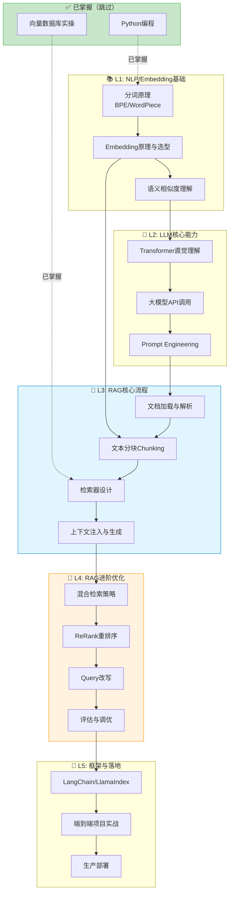

# 🎯 RAG开发学习路径（精简版）

> 已跳过：Python编程 ✅ | 向量数据库 ✅

---

## 1. 前置知识清单（更新后）

| 层级 | 知识领域 | 状态 | 备注 |
|------|----------|------|------|
| L0 | **Python编程** | ✅ 已掌握 | 跳过 |
| L1 | **向量数据库** | ✅ 已掌握 | 跳过 |
| L1 | **NLP基础** | 🔴 需学习 | Embedding原理是关键 |
| L2 | **LLM基础** | 🔴 需学习 | Prompt Engineering核心 |
| L3 | **RAG架构** | 🔴 目标 | 核心学习内容 |

---

## 2. 精简学习路径图



---

## 3. 帕累托法则：20%核心 → 80%效果

---

### 📦 L1: NLP/Embedding基础

| 20%核心（必学） | 80%枝节（可跳过） |
|----------------|------------------|
| ✅ BPE/WordPiece分词思想 | ❌ 传统NLP算法(HMM/CRF) |
| ✅ Embedding是什么、为什么 | ❌ Word2Vec数学推导 |
| ✅ 稠密向量 vs 稀疏向量 | ❌ 各种词向量历史演进 |
| ✅ 文本预处理基本流程 | ❌ 命名实体识别/句法分析 |

**🎯 原子化检查问题：**
```
□ BPE分词解决了什么问题？"unhappiness"会怎么切？
□ 为什么要把文本转成向量？直接比较字符串不行吗？
□ 768维向量中，每一维代表什么含义？
□ 稠密向量和稀疏向量(如TF-IDF)的本质区别？
□ 两个句子语义相似，它们的向量有什么特点？
```

**📖 推荐学习资源：**
- 3Blue1Brown词向量可视化视频
- OpenAI Embedding文档

---

### 📦 L2: LLM核心能力

| 20%核心（必学） | 80%枝节（可跳过） |
|----------------|------------------|
| ✅ Attention机制直觉 | ❌ 多头注意力矩阵运算 |
| ✅ GPT自回归生成原理 | ❌ BERT及各种变体细节 |
| ✅ Temperature/Top-p作用 | ❌ 采样算法实现细节 |
| ✅ System/User角色设计 | ❌ RLHF/PPO训练细节 |
| ✅ Few-shot Prompting | ❌ 复杂Prompt框架(CoT变体) |

**🎯 原子化检查问题：**
```
□ Attention机制一句话怎么解释？它在"看"什么？
□ GPT生成文字时，下一个token是怎么选出来的？
□ temperature=0 和 temperature=1 输出有何区别？
□ system prompt的作用是什么？不写会怎样？
□ 什么是Few-shot？给一个实际例子？
□ Token和字符有什么区别？"你好"是几个token？
```

**📖 推荐学习资源：**
- Jay Alammar的Transformer图解
- OpenAI Prompt Engineering指南

---

### 📦 L3: RAG核心流程 ⭐重点

| 20%核心（必学） | 80%枝节（可跳过） |
|----------------|------------------|
| ✅ RAG整体Pipeline理解 | ❌ 所有文件格式解析细节 |
| ✅ 固定大小+重叠分块 | ❌ 语义分块复杂算法 |
| ✅ Embedding模型调用 | ❌ 自训练Embedding |
| ✅ Top-K相似度检索 | ❌ 图检索/知识图谱 |
| ✅ Context拼接Prompt | ❌ 复杂模板引擎 |

**🎯 原子化检查问题：**
```
□ 画出RAG的完整流程图（从用户提问到返回答案）？
□ 为什么需要分块？不分块直接扔给LLM不行吗？
□ chunk_size=500, overlap=100 具体是什么意思？
□ 分块太大和太小分别有什么问题？
□ 检索到3个chunk后，怎么组织成prompt给LLM？
□ 如果检索到的内容和问题无关，LLM会怎么回答？
□ Embedding模型和生成模型(GPT)的区别是什么？
```

**📖 核心代码模式：**
```python
# RAG最小完整流程
docs = load_documents("data/")           # 1.加载
chunks = split_text(docs, size=500)      # 2.分块
vectors = embed(chunks)                  # 3.向量化
store.add(vectors)                       # 4.存储
# --- 以上离线，以下在线 ---
query_vec = embed(user_query)            # 5.查询向量化
results = store.search(query_vec, k=3)   # 6.检索
context = "\n".join(results)             # 7.组装上下文
answer = llm(f"根据:{context}\n回答:{query}")  # 8.生成
```

---

### 📦 L4: RAG进阶优化

| 20%核心（必学） | 80%枝节（可跳过） |
|----------------|------------------|
| ✅ 关键词+语义混合检索 | ❌ 复杂融合权重算法 |
| ✅ ReRank概念与使用 | ❌ 训练自定义ReRank模型 |
| ✅ Query改写基础 | ❌ HyDE等高级改写技术 |
| ✅ 命中率/召回率概念 | ❌ 完整RAGAS评估体系 |
| ✅ 多轮对话历史管理 | ❌ 复杂记忆压缩算法 |

**🎯 原子化检查问题：**
```
□ 纯语义检索会漏掉什么情况？举例说明？
□ BM25和向量检索各自的优势是什么？
□ ReRank为什么能提升效果？它和首次检索有何不同？
□ 用户问"它多少钱"，为什么需要Query改写？
□ 怎么判断检索结果好不好？用什么指标？
□ 多轮对话中，历史消息怎么处理？全部塞进去吗？
```

**📖 关键优化点速记：**
```
检索质量差 → 混合检索 + ReRank
答非所问   → Query改写 + 优化Prompt
上下文不够 → 调整chunk_size/overlap
幻觉严重   → 加强"仅根据上下文回答"指令
```

---

### 📦 L5: 框架与落地

| 20%核心（必学） | 80%枝节（可跳过） |
|----------------|------------------|
| ✅ LangChain: Chain/Retriever抽象 | ❌ LangChain所有模块 |
| ✅ LlamaIndex: Index基础用法 | ❌ 全部Index类型细节 |
| ✅ 一个完整项目跑通 | ❌ 追求完美架构 |
| ✅ 基本错误处理与重试 | ❌ 复杂可观测性系统 |
| ✅ FastAPI简单部署 | ❌ K8s/微服务架构 |

**🎯 原子化检查问题：**
```
□ LangChain的Chain是什么设计思想？
□ LangChain和LlamaIndex的定位区别？
□ 用LlamaIndex 10行代码实现一个问答？
□ LLM调用失败时，代码应该怎么处理？
□ 如何把RAG包装成REST API？
```

---

## 4. 🚀 推荐学习时间线（已优化）

```
Week 1:    NLP基础 + Embedding原理
              ↓
Week 2:    LLM API调用 + Prompt Engineering
              ↓
Week 3-4:  RAG核心流程（手写一遍Pipeline）
              ↓
Week 5:    LangChain/LlamaIndex框架实操
              ↓
Week 6-7:  进阶优化（混合检索+ReRank+评估）
              ↓
Week 8:    完整项目 + 部署上线
```

---

## 5. 🛠️ 推荐第一个练手项目

**「PDF智能问答助手」**

```
目标：上传PDF → 提问 → 获得基于文档的回答

技术栈：
- 文档解析：PyPDF2 / pdfplumber
- 向量库：你已掌握的任意一个
- 框架：LangChain 或 LlamaIndex
- LLM：GPT-4o-mini / Claude / 通义千问

进阶挑战：
✅ 基础版：单PDF问答
✅ 进阶1：支持多文件
✅ 进阶2：加入ReRank
✅ 进阶3：混合检索
✅ 进阶4：多轮对话记忆
```

---

需要我针对 **L1-NLP基础** 或 **L3-RAG核心流程** 展开详细讲解吗？